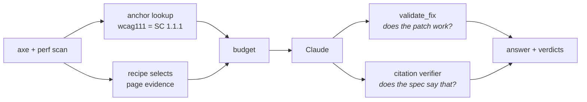
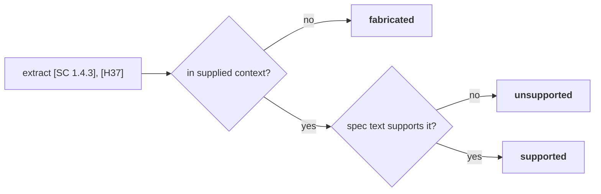
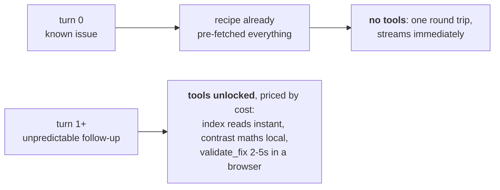

# Design write-up

I went deep on **Layer 1 (Retrieval & Grounding)** and **Layer 2 (Tool Use & Agentic)**, plus the
**Context Engineering** stretch. They compose: 1 and 2 decide what the model sees each turn, and
the stretch is the budget on top. Picking 1 and 3 would have left the stretch nothing to budget.

One idea holds it together: **the assistant checks its own answer before you read it.**

## Layer 1: Retrieval & Grounding

The riskiest thing this assistant can do is name the wrong criterion in confident prose. A
developer reading "SC 1.4.3 requires…" has no cheap way to check. So criterion identity is never
generated: axe tags every rule with the criterion behind it, making "which criterion applies" a
dictionary lookup against the W3C's own `wcag.json`, vendored here. No embeddings, no threshold,
nothing that can be confidently wrong. That is my answer to when built-in knowledge is good
enough: for criterion identity, never. A second path (BM25 + bge-small, RRF-fused) handles only
follow-ups phrased as prose, and never decides which criterion applies.

Flavour (normative, understanding, technique, community) decides how a chunk is *presented*, not
just whether it's retrieved. Normative text is quoted verbatim as the requirement; techniques are
labelled informative. That difference is what stops the model writing "WCAG requires
`aria-label`", which it doesn't; it requires an accessible name.

A citation counts as fabricated even when the criterion is real and relevant: producing the
number from memory is the failure mode, and being lucky about it is not a defence. Stage 3 sees
only the spec text and the one claiming sentence, because a judge shown everything the generator
saw inherits its blind spots. Bad citations render struck-through beside the real
text; deleting them quietly would make the answer look more trustworthy while making it less so.
LCP has no anchor at all and the prompt says so out loud, so the line between conformance failure
and performance finding falls out of the architecture.

**Not built:** reranking, query rewriting, a vector database. 1,075 chunks is a 1.6 MB matrix and
a dot product, and all three would add a failure mode to the one path that can't fail today.

## Layer 2: Tool Use & Agentic

The whole latency answer is that the first turn and later turns aren't the same thing.

Each tool description states its own cost, because a model that can't see cost can't trade off
against it. `contrast_ratio` exists so the model never does that arithmetic: a wrong ratio is the
perfect wrong-but-plausible failure, since it looks like a fact and nobody re-checks it.
`validate_fix` applies the proposed markup to the real page and re-runs axe, returning `cleared`,
`partial` or `regressed` plus anything newly introduced. That is the brief's "fixed one thing,
broke another", measured.

Tools never raise. Every one returns the same discriminated union:

| `status` | Behaviour |
|---|---|
| `ok` | data |
| `not_found` | plus the 3 nearest selectors, so a miss is a lead rather than an invitation to invent |
| `stale` | page hash moved, so the tool refuses to answer at all |
| `ambiguous` / `timeout` | reason + suggestion |

Answering from a stale index is worse than admitting the page moved. A full re-scan is a button,
not a tool, because it costs 30 seconds of someone's time. Nothing on turn 0 may block either:
the encoder takes ~22s to load on CPU, so it warms on a background thread, safe only because the
anchor never used embeddings.

Model choice follows grounding strength rather than being set globally. Anchored types get Haiku,
since once the criterion is looked up and the contrast maths computed, what's left is
explanation. The unanchored LCP path gets Sonnet: it's where the small model wobbled, one patch
in three introducing a new critical violation.

**Not built:** parallel tool calls (all calls in a turn total ~50 ms, so concurrency optimises
0.05% of it); a tool that edits real files (proposing a patch and applying one are different
trust levels); multi-page crawl, auth, accounts.

## Stretch: Context Engineering

The uncomfortable part: **the DOM fits.** Context windows run to a million tokens; a government
homepage is a few hundred thousand at worst. Capacity isn't the constraint. What cutting buys is
cost, TTFT, and mainly quality. Hand a model the whole DOM and it writes generic advice, because
nothing tells it which 40 nodes out of 4,000 are the answer. Selection is the signal.

Each recipe answers one question: which facts fully determine *this* fix?

| Rule family | Keeps | Why |
|---|---|---|
| naming (`image-alt`, `link-name`, `label`) | element, landmark path, enclosing `<a>`/`<figure>`/`<figcaption>`, sibling text, filename | the question is what the name should *say* |
| `color-contrast` | element, computed colour, **the ancestor that actually paints the background**, font size and weight | those five facts fix ratio *and* threshold |
| ARIA | element, explicit and implicit role, parent and child roles | a role-graph problem; prose is noise |
| `lcp` | LCP element, its request, render-blocking `<head>` resources in order | LCP is a chain; the blocker is usually in `<head>` |

The contrast recipe is the argument. On the fixture the failing `
` is transparent, so the
colour a user sees is painted by a `<section>` three levels up. Walking up gives **3.08:1**.
Assuming a white page background, which is what a model without that context does, gives
**3.45:1** and a recommended colour that still fails.

Cache breakpoints go by stability, not by section: system and tools frozen all session, spec and
page evidence frozen per issue, conversation volatile, so a ten-turn follow-up pays for the page
context once. The index is keyed by `(url, content_hash)`, so many developers on one page share a
cached prefix and staleness comes from re-hashing rather than a TTL. Dropped blocks keep their
reason and still render in the inspector: what got cut tells you more than what survived.

**Not built:** conversation summarising (drop-oldest instead: cruder, but visible, and it can't
silently lose a constraint stated three turns ago); recipes beyond the four families, so the rest
get a labelled generic fallback and the UI says so; more than one performance issue type.

## Evaluation, and what I'd do next

Layer 3 wasn't one of my two, but the deliverable needs artifacts: 8 cases, 5 dimensions, **3
decided by running code rather than by a judge.** Criterion correctness comes from the citation
verifier; fix validity and collateral damage from putting the model's own patch through
`validate_fix`. A judge grades only specificity and scope. That split is my answer to
*wrong-and-obviously-wrong vs. wrong-but-plausible*: the plausible ones worry me, so the
dimensions where a plausible error does most harm aren't left to a judge sharing the generator's
blind spots.

**The suite is noisier than I first claimed, and `evals/rubric.md` now says so.** Three
consecutive runs, no code changed, scored **1.55, 1.30, 1.46**: a spread of 0.25, not the ±0.10 I
had documented. I was also wrong to call criterion correctness deterministic, since its support
check is a model call, and fix validity is a deterministic scorer over a non-deterministic input,
because whether an answer contains an HTML block varies between runs. The defensible claim isn't
that these dimensions are stable, it's that they can't be fooled by fluent prose.

**Next, in order.** Recipes for the top 20 axe rules by frequency: coverage is what makes this
usable, and the fallback produces exactly the generic advice this design argues against. Then
more cases and repeated runs per case, since a ±0.25 band can't detect the regressions the suite
exists to catch. Reranking last. That ordering is a claim about developer experience: someone
staring at 47 violations hits the generic fallback long before the limits of technique retrieval.
