# The Accessibility & Performance Fix Assistant — complete walkthrough

*Private working notes (`docs/` is gitignored). `DESIGN.md` is the two-page deliverable
the reviewer reads; `README.md` is setup and commands. **This** file is the one that
makes you able to defend the whole thing out loud.*

**How to read this.** Parts 1–2 assume you know nothing about accessibility or about
retrieval systems, and build both vocabularies from zero. Part 3 restates the assignment
and maps every requirement to a thing that exists in the repo. Part 4 is the system in
diagrams. Parts 5–9 go module by module and decision by decision. Parts 10–13 are the
material you actually get asked about in the room: what broke, what is weak, what you'd
do next, and how to answer the hard questions.

---

# Part 0 — The 90-second pitch

> A developer runs an automated accessibility scan on a government homepage and gets back
> 47 violations with names like `aria-allowed-attr` and a wall of CSS selectors. They are
> a competent developer, not an accessibility specialist. Today they Google the rule, skim
> a W3C page, guess how it maps to their markup, and sometimes make things worse.
>
> I built the layer that sits between the scan result and the developer. It scans the page
> in a real browser, and for each finding it assembles a small, deliberately chosen packet
> of evidence — the failing element plus exactly the surrounding facts that determine
> *this class* of fix — together with the verbatim text of the WCAG criterion that actually
> applies. Claude explains the issue in plain language and writes corrected markup for that
> specific page.
>
> The part I would defend hardest: **the assistant checks its own answer before the
> developer reads it**, in two independent ways. It can apply its own proposed patch to the
> real page in a headless browser and re-run the scan — reporting both whether the violation
> cleared and whether the patch introduced anything new. And every WCAG criterion it cites
> is checked twice: was that identifier actually in the context I supplied, and does that
> text actually support the sentence the model wrote. Bad citations render struck-through
> beside the real text rather than being quietly deleted.
>
> The thing I am proudest of is one number. On the fixture, a failing paragraph is
> transparent, so the colour a user actually sees is painted by a `<section>` three levels
> up the tree. Walking up to find it gives a contrast ratio of **3.08:1**. An assistant that
> assumes a white page background computes **3.45:1** and recommends a replacement colour
> that *still fails*. That single number is the entire argument for issue-type-specific
> context extraction.

---

# Part 1 — The domain, from zero

Nothing in this part assumes prior knowledge. Skip any section you already own.

## 1.1 What "web accessibility" actually means

Some people cannot use a web page the way you do:

- **Blind users** hear the page read aloud by a **screen reader** and navigate by keyboard.
  They never see layout, colour, or images.
- **Low-vision users** zoom heavily, or need strong colour contrast to read text at all.
- **Motor-impaired users** may never touch a mouse — everything happens via keyboard or a
  switch device.
- **Cognitive / neurodivergent users** need predictable structure and plain language.

"Accessibility" (abbreviated **a11y** — *a*, eleven letters, *y*) is the practice of
building pages those people can use. For a government site it is usually a *legal*
obligation, which is exactly why the brief picked a government product team.

**The key intuition for everything that follows:** a screen reader does not read your HTML.
It reads a parallel structure the browser builds called the **accessibility tree**, derived
from your HTML. Your `` becomes a node whose *name* comes from the `alt` attribute. No
`alt` means that node has no name, and the screen reader has nothing useful to say — often
it falls back to the filename, so a user hears "budget-meeting-2026-dot-jay-peg".

## 1.2 Accessible name — the single most important concept

The **accessible name** is the short string a screen reader announces for an element. The
browser *computes* it from several sources in priority order:

```
aria-labelledby  >  aria-label  >  native (alt / <label> / button text)  >  title
```

Three of the eight axe rules this project handles in depth are the same question wearing
different clothes: **this element has no accessible name — and the developer's real problem
is not "add an attribute", it is "what should the name say?"**

- `` with no `alt` → no name.
- Icon-only `<a href="/search"><span class="icon-search"></span></a>` → no text inside the
  link, so a screen reader announces just "link". Where does it go? No way to know.
- `<input type="email">` with no associated `<label>` → the user hears "edit text" and has
  no idea what to type.

That distinction — *the mechanism is obvious, the content is the hard part* — is why one of
my four context recipes spends its whole budget on **surrounding prose** rather than on DOM
structure. See §7.2.

## 1.3 WCAG — the standard

**WCAG** = *Web Content Accessibility Guidelines*, published by the **W3C** (the standards
body for the web). Current version 2.2. Essentially every accessibility law in the world
points at it.

Its structure is a four-level tree:

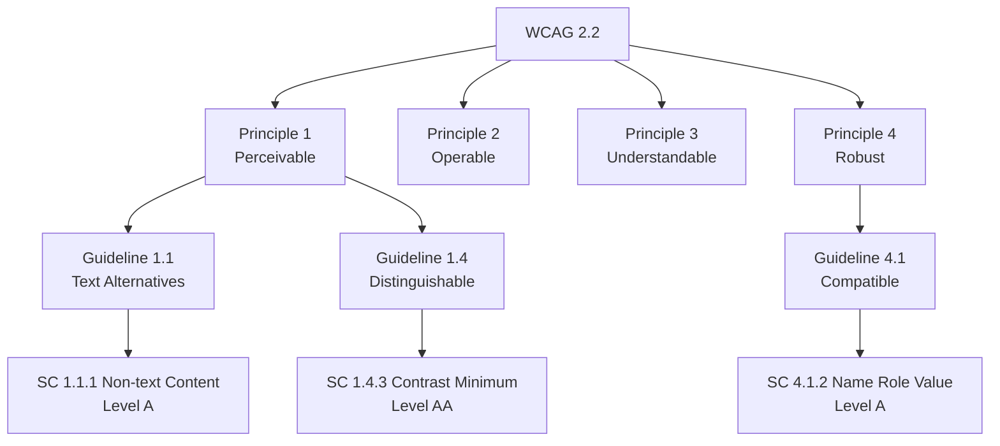

- **Principles** (4) are the philosophy: *POUR* — Perceivable, Operable, Understandable,
  Robust.
- **Guidelines** are goals. Not testable.
- **Success Criteria (SC)** are the testable requirements — 87 of them in WCAG 2.2. Each has
  a dotted number like **1.4.3**, read as principle 1, guideline 4, criterion 3. **This
  number is what the assistant cites, and the thing it must never get wrong.**
- **Conformance levels**: each SC is **A** (basics), **AA** (what legislation actually
  requires), or **AAA** (aspirational).

The criteria that matter in this repo:

| SC | Name | Level | Plain English |
|---|---|---|---|
| **1.1.1** | Non-text Content | A | Every image/icon needs a text alternative serving the same purpose |
| **1.3.1** | Info and Relationships | A | Structure conveyed visually must also exist in the markup |
| **1.4.3** | Contrast (Minimum) | AA | Text needs ≥4.5:1 against its background (3:1 if large) |
| **2.4.4** | Link Purpose (In Context) | A | A link's purpose must be determinable from its text plus context |
| **4.1.2** | Name, Role, Value | A | Every interactive control must expose a name, a role, and its state |

## 1.4 Normative vs informative — the distinction the whole grounding layer turns on

W3C publishes **several document families** about the same criterion, and they do not carry
equal authority. Getting this wrong is how an assistant says something confidently false.

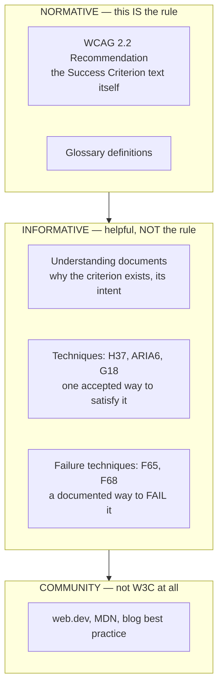

**The failure this prevents, concretely.** SC 4.1.2 requires an element to have an
*accessible name*. It does **not** require `aria-label`. `aria-label` is Technique
**ARIA6**, one of several accepted ways. A model handed all of this as one undifferentiated
blob of retrieved text writes:

> "WCAG requires you to use `aria-label` here."

That is false. A developer who believes it starts sprinkling `aria-label` on things where a
native `<label>` or visible text would be better — which can make the page *worse*, because
`aria-label` overrides visible text and breaks voice-control users who say the name they can
actually see.

So in this system **flavour is not metadata, it is presentation**. Every retrieved chunk
carries a `flavour` field, and the prompt renders each one under a header that states its
authority level out loud. See §6.4.

## 1.5 axe-core — what a "scan" actually is

**axe-core** is an open-source accessibility testing engine from Deque. It is the engine
inside Chrome DevTools' accessibility audit, inside Lighthouse's a11y section, and inside
most CI accessibility tools. It is JavaScript: you inject it into a loaded page, call
`axe.run()`, and it walks the DOM applying ~90 rules.

It is **automated**, which means it catches roughly 30–40% of real accessibility problems —
the mechanically checkable ones. It can tell you alt text is *missing*; it cannot tell you
whether alt text is *good*. That gap is, not coincidentally, exactly where this assistant
adds value.

A violation looks like this:

```json
{
  "id": "color-contrast",
  "impact": "serious",
  "help": "Elements must meet minimum color contrast ratio thresholds",
  "helpUrl": "https://dequeuniversity.com/rules/axe/4.10/color-contrast",
  "tags": ["cat.color", "wcag2aa", "wcag143", "TTv5", "ACT"],
  "nodes": [{
    "target": ["section.news > article > p"],
    "html": "<p class=\"muted\">The riverfront path will be closed...</p>",
    "failureSummary": "Fix any of the following: Element has insufficient color contrast of 3.08 ..."
  }]
}
```

**The load-bearing detail in that blob, and the single best decision in the whole project:**
the `tags` array contains `wcag143`. axe-core's own rule authors already did the mapping
from rule → success criterion. `wcag143` means SC 1.4.3. So the question *"which WCAG
criterion does this violation correspond to?"* — the highest-stakes fact in the system — is
**a regex and a dictionary lookup, never something a language model guesses.** See §7.1.

Other vocabulary from that blob:

- **rule id** (`color-contrast`, `image-alt`, `aria-allowed-attr`) — axe's own name for the check.
- **impact** — `minor` / `moderate` / `serious` / `critical`.
- **target / selector** — a CSS selector pointing at the offending element. Note axe emits its
  *own* selector syntax, which is why `scanner/cli.mjs` re-resolves every target back into the
  selector format used by my node index — otherwise nothing joins.
- **failureSummary** — axe's own prose explanation, useful as supplementary context.

## 1.6 ARIA — and why it produces the "cryptic" errors

**ARIA** = *Accessible Rich Internet Applications*: HTML attributes that tell the
accessibility tree things plain HTML cannot express. Three kinds:

- **Roles** — `role="button"`, `role="listitem"`, `role="switch"`. *What is this thing?*
- **Properties** — `aria-label`, `aria-labelledby`, `aria-describedby`. *What is it called?*
- **States** — `aria-checked`, `aria-expanded`, `aria-pressed`. *What condition is it in?*

Every HTML element also has an **implicit role** for free: `<button>` is implicitly `button`,
`<nav>` is `navigation`, `<a href>` is `link`. Writing `role="..."` sets an **explicit role**
that overrides it.

**The catch, and the first rule of ARIA: each role only permits certain states and
properties.** `aria-checked` is meaningful on `role="checkbox"`, `role="radio"` and
`role="switch"` — things with a checked/unchecked condition. It is **not allowed** on
`role="button"`, because a button has no checked state; it has a *pressed* state
(`aria-pressed`).

So the fixture contains this, deliberately:

```html
<div role="button" tabindex="0" aria-checked="false" class="alert-toggle">
  Subscribe to service alerts
</div>
```

and axe reports **"ARIA attribute is not allowed: aria-checked='false'"** — literally the
brief's example of a cryptic error. The developer has no idea whether to delete the
attribute, change the role, or rewrite the component.

**Why this needs its own context recipe.** This is a *graph* problem, not a prose problem. To
answer correctly you need the element's explicit role, its implicit role, the offending
attribute, and the roles of its parent and children — because rules like
`aria-required-parent` (a `role="listitem"` with no `role="list"` ancestor, also in the
fixture) are about relationships. Nearby paragraph text is pure noise here. Contrast that with
the naming recipe, where nearby text *is the entire answer*. Same page, same budget, opposite
content. That asymmetry is the thesis of the stretch layer.

## 1.7 Colour contrast — the maths, and why the model is banned from doing it

**Contrast ratio** measures how distinguishable two colours are, from 1:1 (identical) to 21:1
(pure black on pure white). WCAG computes it from *relative luminance*:

```
luminance L = 0.2126·R + 0.7152·G + 0.0722·B      (after a gamma curve on each channel)
ratio       = (L_lighter + 0.05) / (L_darker + 0.05)
```

Thresholds at level AA:

| Text | Threshold |
|---|---|
| Normal text | **4.5:1** |
| **Large** text — ≥24px, **or** ≥18.66px when bold | **3:1** |

That "large text" rule is why the eval suite contains a case where the developer asks *"could
I just make it bold instead of changing the colour?"* Bold at 16px does **not** reach the
large-text threshold, so 4.5:1 still applies. The answer is no — and it is a good test of
whether the model used the computed threshold or a vague memory.

**Why `app/contrast.py` exists at all.** A wrong contrast ratio is the *perfect*
wrong-but-plausible failure: a number, stated with confidence, that looks exactly like a fact,
and no developer is going to re-derive a gamma-corrected luminance by hand to check it. So the
system computes every ratio itself, ships it into the prompt as a computed fact, and the system
prompt says explicitly: *"Numbers the system computed for you are authoritative. Do not
recompute them."* There is also a `contrast_ratio` tool so that if the model wants to test a
*different* colour on a follow-up, it asks rather than does arithmetic.

**And the trap that makes this the flagship case.** CSS backgrounds are transparent by default.
The failing `<p class="muted">` has `background-color: rgba(0, 0, 0, 0)`. Its own background is
*nothing*. What the eye sees is whatever ancestor actually paints — here `<section class="news">`
at `#f2f2f2`, three levels up.

```
#8a8a8a on #f2f2f2  ->  3.08:1     <- correct: what the user actually sees
#8a8a8a on #ffffff  ->  3.45:1     <- what you get assuming "white page"
                                      both fail, but they demand different fixes
```

If you believe you are at 3.45 and need 4.5, you darken a little. That new colour, on the *real*
grey background, still fails. **The assistant would have confidently handed the developer a fix
that does not work.** Full walkthrough in §7.2.

## 1.8 Performance — Lighthouse, Core Web Vitals, LCP

The brief pairs accessibility with performance because the pain is identical: a tool gives you a
number, and the number does not tell you *why*.

- **Lighthouse** — Google's page-auditing tool (also in Chrome DevTools). Scores performance,
  accessibility, SEO, best practices. Its reports are enormous JSON — the brief points out they
  run to hundreds of MB at scale.
- **Core Web Vitals** — the three user-centric metrics Google settled on:
  - **LCP** (Largest Contentful Paint) — time until the biggest visible thing finishes rendering.
    Proxy for *"when does this page feel loaded?"* Good ≤ **2500 ms**.
  - **CLS** (Cumulative Layout Shift) — how much content jumps around.
  - **INP** (Interaction to Next Paint) — how fast the page responds to input.

This project handles **LCP only**, deliberately: one performance issue type done properly rather
than three sketched.

**Why LCP is a fundamentally different shape of problem to an a11y violation.** An accessibility
violation is *local* — the broken thing and the fix are the same element. LCP is a **chain**. The
LCP element might be a hero image that is perfectly fine, while the real culprit is a
render-blocking stylesheet in `<head>` that the browser had to download and parse before it would
paint anything at all.

**Render-blocking** means: the browser will not paint until this resource is fetched and
processed. A `<link rel="stylesheet">` in `<head>` blocks (unless its `media` says otherwise). A
`<script src>` without `async` or `defer` blocks.

The fixture stacks the deck on purpose:

```html
<link rel="stylesheet" href="./base.css">
<link rel="stylesheet" href="./theme.css">
<link rel="stylesheet" href="./print.css">   <!-- blocks render, yet only ever used for printing -->
...
  <!-- ~1 MB, no priority hint -->
```

Two real findings sit there: `print.css` blocks rendering for a stylesheet no screen user will
ever need (fix: `media="print"`), and a ~1 MB hero image with no `fetchpriority="high"` and no
`<link rel="preload">`. So the LCP recipe deliberately spends most of its budget on **things that
are not the failing element**: render-blocking resources in `<head>` in document order, their
sizes and timings, and which resource hints are *absent*.

**And the honest asymmetry:** *there is no WCAG criterion for LCP.* It is not a conformance
failure, it is a performance finding. So the deterministic anchor returns **nothing** for this
issue type. The prompt says so out loud, in those words, and the inspector shows the empty
normative block. That is not a gap — it is the architecture correctly reporting the limits of its
own grounding, and it is why LCP is the one issue type routed to a bigger model (§7.5).

## 1.9 Domain concepts — one-line recap

| Term | One line |
|---|---|
| a11y | Numeronym for "accessibility" |
| Screen reader | Reads the accessibility tree aloud; navigated by keyboard |
| Accessibility tree | Parallel structure the browser derives from the DOM for assistive tech |
| Accessible name | The string a screen reader announces for an element |
| WCAG 2.2 | W3C's accessibility standard; 87 testable Success Criteria |
| SC (Success Criterion) | One testable requirement, numbered like 1.4.3 |
| Level A / AA / AAA | Conformance tiers; AA is what law generally requires |
| Normative | The actual requirement text. Binding. |
| Informative | Understanding docs and Techniques. Helpful, not binding. |
| Technique (H37, ARIA6, G18) | One documented way to satisfy a criterion |
| Failure technique (F65, F68) | A documented way to *fail* — often the most actionable grounding |
| axe-core | JS engine that mechanically finds ~30–40% of a11y problems |
| ARIA role / property / state | Attributes describing elements to assistive tech |
| Contrast ratio | 1:1 to 21:1; AA needs 4.5:1 normal, 3:1 large |
| Lighthouse | Google's page-auditing tool |
| Core Web Vitals | LCP, CLS, INP |
| LCP | Time until the largest visible element paints. Good ≤ 2500 ms |
| Render-blocking | A resource the browser must finish before painting anything |

---

# Part 2 — The AI concepts, from zero

## 2.1 Tokens, context windows, and why they cost money

An LLM does not see characters — it sees **tokens**, roughly word-fragments. English prose runs
about **3.6 characters per token** (the constant `CHARS_PER_TOKEN` in `app/context.py`); code and
markup are denser.

- **Context window** — the maximum tokens a model can consider at once. Claude's current models
  run to 200K, and up to 1M in long-context configurations.
- You are **billed per input token and per output token**, so every token you send costs money
  and adds latency.

**A point I make explicitly in the design write-up, because it is counterintuitive:** *the DOM
fits.* A government homepage is a few hundred thousand tokens at worst; the window is a million.
**Capacity is not the constraint.** What cutting context buys is cost, time-to-first-token, and —
the one that actually matters — **quality**. Hand a model the whole DOM and it writes generic
advice, because nothing in the payload tells it which 40 nodes out of 4,000 are the answer.
**Selection is signal, not just savings.** That framing is what the ablation experiment (§8.7) was
built to test.

## 2.2 Hallucination, and the specific flavour that matters here

An LLM generates the most plausible next token. It has no internal notion of "I do not know
this". When it lacks a fact, it produces something fact-shaped. That is **hallucination**.

The brief names the danger precisely: a developer following hallucinated guidance might ship
something that makes accessibility *worse*. There are two failure shapes, and they are not equally
dangerous:

| Failure | Example | Danger |
|---|---|---|
| **Wrong and obviously wrong** | "Add `<blink>` to fix contrast" | Low — the developer notices |
| **Wrong but plausible** | "SC 1.4.3 requires 3:1 for body text" / "the ratio here is 4.6:1" | **High** — indistinguishable from correct, nobody re-checks |

Everything in this system's verification design follows from the answer *the plausible ones worry
me more*: the dimensions where a plausible error does the most damage are decided by **running
code**, never by a language model judging prose. See §8.

## 2.3 Grounding and RAG

**Grounding** = giving the model the authoritative source text *inside the prompt*, so it reads
rather than recalls.

**RAG** (Retrieval-Augmented Generation) is the standard pattern:

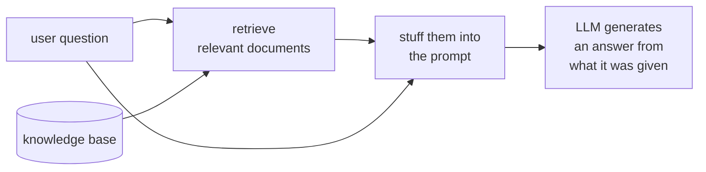

The bet is that a model reading a quoted paragraph is far more reliable than a model recalling one
from training.

**Where this project departs from textbook RAG, and it is the single most important design
decision:** for the highest-stakes fact — *which criterion applies* — I do not retrieve by
similarity at all. axe already told me. So that lookup is deterministic: no embeddings, no
similarity threshold, nothing that can be confidently wrong. Similarity search is reserved for
the genuinely fuzzy half of the problem. See §7.1.

## 2.4 Chunks, embeddings, cosine similarity

You cannot fit the whole WCAG corpus into a prompt, so you split it into **chunks** — small
passages, here capped at ~1,400 characters and split on document headings.

An **embedding** is a list of numbers (a vector) representing a chunk's *meaning*. Passages about
similar topics land near each other in that space. Intuition: a map where "contrast ratio" and
"colour difference" are neighbours even though they share no words.

- This project uses **`BAAI/bge-small-en-v1.5`**, a small open-source sentence-transformer that
  runs locally on CPU and produces **384-dimensional** vectors.
- **Cosine similarity** measures the angle between two vectors — 1.0 identical direction, 0.0
  unrelated. With vectors normalised to unit length, cosine similarity is just a dot product,
  which is why the whole search is one matrix multiply.

**Why local rather than a hosted embedding API:** no second API key for a reviewer to obtain, and
the eval suite runs fully offline and reproducibly.

## 2.5 BM25, hybrid retrieval, and RRF

**BM25** is classic *lexical* search — the algorithm behind Elasticsearch's default ranking. It
scores documents on exact word overlap, weighted so rare words count more. It is excellent at
exactly the thing embeddings are weakest at: **rare literal identifiers** like `aria-labelledby`
or `H37`.

The two are complementary:

| | Strength | Weakness |
|---|---|---|
| **BM25** (lexical) | Exact rare terms, IDs, attribute names | Misses paraphrase — "colour difference" ≠ "contrast" |
| **Dense** (embeddings) | Paraphrase and concepts | Can miss an exact rare token entirely |

**Hybrid retrieval** runs both. But their scores are on incompatible scales — a BM25 score of 12.4
and a cosine of 0.83 cannot be added. The standard fix is **Reciprocal Rank Fusion (RRF)**: throw
away the scores, keep only the *ranks*, and score each document as

```
score(d) = Σ over rankers  1 / (k + rank_in_that_ranker)        with k = 60
```

`k = 60` is the constant from the original RRF paper, and it is set in `config.py` as `RRF_K`. RRF
is scale-free, needs no tuning, and a document that both rankers like rises to the top.

## 2.6 Prompt caching

Sending the same long prefix on every turn is wasteful. **Prompt caching** lets you mark a
boundary in the prompt — a **cache breakpoint** — and the provider stores the processed prefix.
Later requests with a byte-identical prefix are billed at a large discount and skip re-processing.

The rule that makes it work: **the cache matches on a prefix, so everything before a breakpoint
must be byte-identical.** One changed character early in the prompt invalidates everything after
it.

This is why the prompt in this project is ordered **by stability, not by topic**:

```
[ system prompt        ]  frozen for the entire session   <- breakpoint 1
[ spec + page evidence ]  frozen for the life of an issue <- breakpoint 2
[ conversation         ]  changes every turn              <- deliberately uncached
```

A ten-turn follow-up conversation therefore pays for the page context **once**. The measured
proof is in the inspector: `cache_read_tokens` should be non-zero on any turn after the first.

## 2.7 Tool use (function calling) and the agentic loop

**Tool use** lets the model call your code. You describe tools as JSON schemas; the model may
respond with `stop_reason: "tool_use"` and a structured call instead of text; you execute it and
feed the result back. That loop repeats until the model produces a final answer.

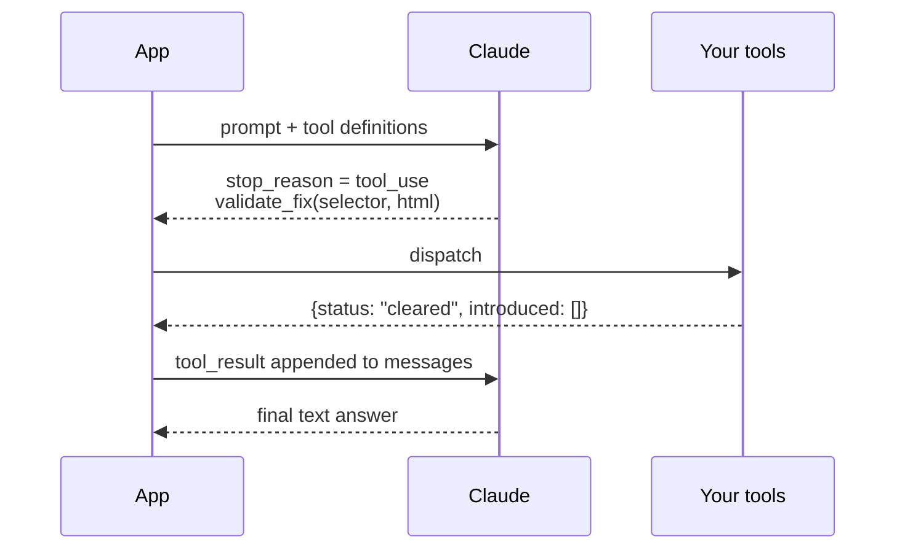

This is the difference between an assistant that can only *say* things and one that can *do*
things. In this project the model can read the page index, look up spec text, compute a contrast
ratio, find related issues, and — the important one — **apply its own proposed patch to the real
page in a headless browser and re-run the scan**.

The loop here is hand-written (~40 lines in `agent.py::run_turn`) rather than using an SDK tool
runner, because span emission and budget accounting happen between rounds anyway, and owning the
loop is easier to explain than hooks into someone else's.

## 2.8 Streaming and Server-Sent Events

**Streaming** means tokens arrive as they are generated rather than all at once at the end. The
number that matters for perceived speed is **TTFT** — time to first token. A 5-second answer that
starts appearing in 800 ms feels fast; a 3-second answer that appears all at once at t=3s feels
slow.

**SSE** (Server-Sent Events) is the transport: a long-lived HTTP response where the server pushes
`data: {...}` lines. Simpler than WebSockets and one-directional, which is all this needs. The
browser reads it with `EventSource`.

The event types on this stream: `bundle` (what context was assembled — sent *before* generation
starts, so the inspector populates immediately), `token`, `tool`, `done`, `error`, `end`.

## 2.9 Evals, LLM-as-judge, and ablations

- **Eval** — a fixed test set plus a rubric, run repeatedly so you can tell whether a prompt
  change, a model swap, or a retrieval change made things *worse*. Without one, you are
  vibes-driven.
- **LLM-as-judge** — using a model to grade another model's output on things only reading can
  assess (is this specific? did it stay in scope?). Cheap and scalable, but it **shares the
  generator's blind spots**: a confidently-wrong answer is convincing to the judge for exactly the
  reasons it was generated.
- **Ablation** — deliberately removing or degrading one component and re-measuring, to prove the
  component earns its place. Here: run the identical pipeline with the recipe replaced by (a) the
  failing element only, and (b) a raw DOM dump truncated to the **same token count**. The second
  arm is the interesting one, because it holds volume constant and varies only *what was chosen*.

## 2.10 AI concepts — one-line recap

| Term | One line |
|---|---|
| Token | Word-fragment unit; ~3.6 chars of English; you pay per token |
| Context window | Max tokens the model can consider at once |
| TTFT | Time to first token — the number that governs perceived speed |
| Hallucination | Confident fabrication when the model lacks a fact |
| Grounding | Putting the authoritative source text in the prompt |
| RAG | Retrieve relevant chunks, then generate from them |
| Chunk | A small passage of source text, independently retrievable |
| Embedding | Vector representing meaning; here 384-dim from bge-small |
| Cosine similarity | Angle between vectors; a dot product when normalised |
| BM25 | Lexical keyword ranking; strong on rare exact terms |
| Hybrid retrieval | Run lexical + dense together |
| RRF | Fuse rankers by rank, not score; k = 60 |
| Prompt caching | Reuse a byte-identical prefix at a discount |
| Cache breakpoint | The marked boundary of that reusable prefix |
| Tool use | Model calls your code via JSON schemas |
| Agentic loop | call -> execute -> feed result back -> repeat |
| SSE | HTTP push transport for streaming tokens to the browser |
| LLM-as-judge | A model grading output; shares the generator's blind spots |
| Ablation | Remove one component, re-measure, prove it earns its place |

---

# Part 3 — The assignment, and the shape of my answer

## 3.1 What was asked

> *Given scan results from a website, build an LLM-powered assistant that can (1) explain what
> each issue means in plain language grounded in the relevant standard, (2) propose a fix specific
> to **this** page, (3) answer follow-ups. The bar: would a developer trust this enough to ship
> the fix without asking a specialist?*

Three layers were offered, **pick two to go deep on**, plus an optional stretch:

| Layer | The question it asks |
|---|---|
| **1 — Retrieval & Grounding** | How does authoritative knowledge reach the model at inference time? How would you catch a criterion cited wrongly? |
| **2 — Tool Use & Agentic** | What can the assistant *do* vs only *say*? How do you trade responsiveness against thoroughness? |
| **3 — Evaluation & Guardrails** | What does "correct" mean here? How do you know a change didn't make things worse? |
| **Stretch — Context Engineering** | What does the model actually receive each turn? What do you keep and what do you cut? |

Plus hard requirements: runs locally, user submits a URL or HTML, sees detected issues, at least
some have an AI explanation path, and — explicitly — **"show us what the model sees, not just what
the user sees"**: logging, a debug panel, a trace view.

## 3.2 Which layers I chose, and the argument for that choice

**Layers 1 and 2, plus the Context Engineering stretch.**

The reasoning I would give out loud: **they compose.** Layer 1 decides *what authoritative text*
reaches the model. Layer 2 decides *what page facts* reach it and when. The stretch layer is the
budget and presentation policy sitting on top of both. Picking 1 and 3 instead would have left the
stretch layer nothing to budget — you cannot do context engineering well without owning both
sources of context.

Layer 3 was not one of my two, but the deliverables require eval artifacts, so it exists at
honest-sketch depth: 8 cases, 5 dimensions, a rubric, a scoring script, three committed runs, and
an ablation harness. I say plainly in the write-up that it is a sketch, and I say plainly what is
wrong with it (§11).

## 3.3 Every requirement, and where it lives in the repo

| The brief asks | What exists | Where |
|---|---|---|
| Submit a URL or HTML, see detected issues | Scan box accepting any URL or a bundled fixture name; issue list per page | [main.py](../app/main.py), [page.html](../app/templates/page.html) |
| Explain in plain language, grounded in the standard | Verbatim WCAG text retrieved deterministically; system prompt enforces plain words and a fixed answer skeleton | [retrieval.py](../app/retrieval.py), `SYSTEM_PROMPT` in [context.py](../app/context.py) |
| Propose a fix specific to *this* page | Four issue-type recipes extracting exactly the determining facts | `recipe_*` in [context.py](../app/context.py) |
| Answer follow-ups | Persisted conversation; tools unlocked from turn 1 onwards | [agent.py](../app/agent.py), [db.py](../app/db.py) |
| **L1** — how authoritative knowledge reaches the model | Deterministic anchor (axe tag → SC) + hybrid semantic path, flavour-differentiated | §6, §7.1 |
| **L1** — catch a wrongly-cited criterion | Three-stage citation verifier: extract → membership → support | [verifier.py](../app/verifier.py), §7.4 |
| **L2** — do vs say | 5 tools, incl. `validate_fix` which patches the real page in a browser and re-scans | `TOOL_DEFINITIONS` in [agent.py](../app/agent.py) |
| **L2** — pre-fetch vs on-demand | Turn asymmetry: turn 0 sends **no tools at all**; turn 1+ unlocks them | `run_turn`, §7.3 |
| **L2** — cheap vs expensive lookups | Every tool description states its own latency, so the model can trade off | `TOOL_DEFINITIONS` |
| **L2** — tool returns something unexpected | One discriminated union for every tool: `ok / not_found / stale / ambiguous / timeout` | `dispatch`, §7.6 |
| **L3** — what "correct" means | 5 dimensions; 3 decided by running code, 2 by judge | [rubric.md](../evals/rubric.md) |
| **L3** — did I make it worse? | MLflow runs with per-dimension metrics; arms comparable in the UI | [run.py](../evals/run.py) |
| **L3** — adjacent questions | Scope section in the system prompt + a dedicated eval case | `SYSTEM_PROMPT`, `scope-adjacent-question` |
| **Stretch** — what to keep and cut | Per-kind token budget; dropped blocks keep their reason and still render | `apply_budget`, §7.2 |
| **Stretch** — conversation grows, page stays | Cache breakpoints by stability; drop-oldest conversation trimming | `build_messages`, `trim_conversation` |
| **Stretch** — cheaper at scale without staleness | Index keyed `(url, content_hash)`; staleness by re-hashing, not TTL | [db.py](../app/db.py) |
| **Observability** — show what the model sees | Context Inspector (3 tabs) + typed MLflow spans, both rendered from one `ContextBundle` | [issue.html](../app/templates/issue.html), [tracing.py](../app/tracing.py) |

## 3.4 The one sentence that holds it together

**The assistant checks its own answer before you read it.** Two independent checks, answering two
different questions:

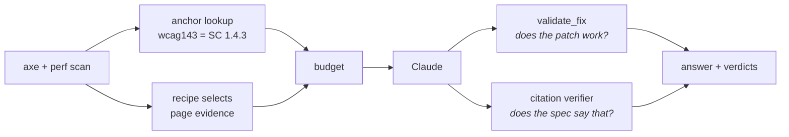

Everything else in the system is in service of making those two checks meaningful.

---

# Part 4 — The system in diagrams

## 4.1 Container architecture — everything, one picture

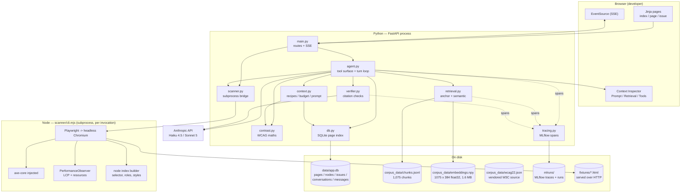

**The one structural thing to say about this diagram:** it is *one flat Python package* and *one
Node file*. There is no service mesh, no queue, no vector database, no ORM. The brief says "if
you're building CRUD or styling components, stop — go work on the AI parts", and I took that
literally. A directory has to earn its place; a package holding a single module is just
indirection.

## 4.2 Request lifecycle — scan

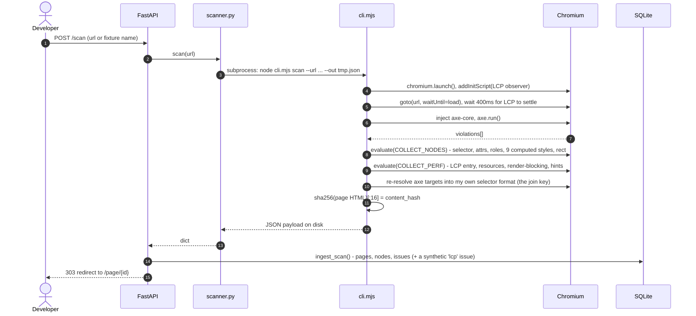

**Two details worth knowing.** First, **fixtures are served over HTTP, not read from `file://`** —
because `file://` provides no Resource Timing API, and therefore no LCP data at all. Second,
`content_hash` is a hash of the rendered page HTML, and it is load-bearing: it is the index key
alongside the URL, and it is how staleness is later detected **by re-hashing rather than by a TTL**.

## 4.3 Request lifecycle — one assistant turn

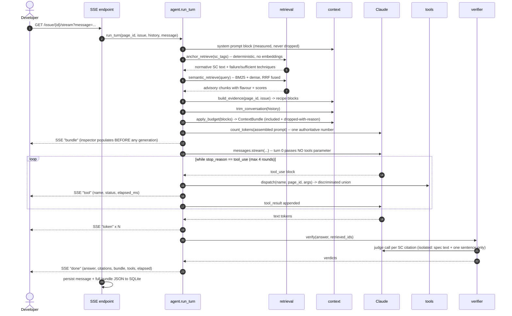

## 4.4 Module dependency graph

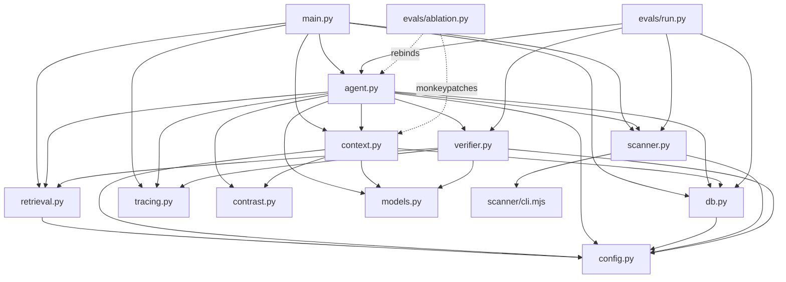

Three things this shows:

- **`config.py` is a leaf everyone depends on.** Every tunable number lives there so the design
  write-up and the code cannot disagree about a figure.
- **`models.py` is the other leaf.** `ContextBundle` is the spine: the prompt is rendered *from*
  it, the inspector *renders* it, MLflow *logs* it. One structure, three consumers, so the debug
  panel physically cannot show something different from what the model received.
- **`agent.py` is the only module that talks to the Anthropic API for generation** (the verifier
  makes its own separate judge call), and it is the only orchestrator.

## 4.5 Data model

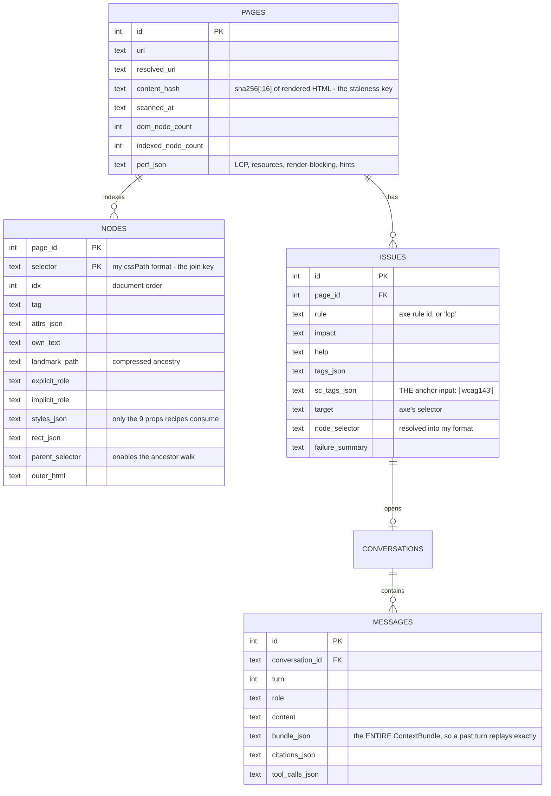

**Why `nodes` exists at all** — this is the quiet centrepiece of the stretch layer. Rather than
keeping raw HTML around and re-parsing it, the scan flattens the DOM into an **addressable index**:
one row per element, keyed by a stable CSS selector, carrying `parent_selector` so the tree can be
walked upward, and carrying **only the nine computed style properties the recipes actually consume**
(colour, background-colour, background-image, font-size, font-weight, display, visibility, opacity,
position). Capturing all ~340 computed properties per node would make the index an order of
magnitude larger for zero gain.

That index is what makes every cheap tool cheap: `get_node` is a primary-key read, the contrast
ancestor walk is one primary-key read per level, and `find_related_issues` is an indexed scan. It is
also what makes the `(url, content_hash)` key work: two developers looking at the same unchanged
page share one index **and one cached prompt prefix**.

**Why `bundle_json` is stored on every message** — so the Context Inspector can render a past turn
*exactly as it happened*, not as a reconstruction. A debug panel fed from a separate code path drifts
from reality within a week.

---

# Part 5 — Module by module

About 2,770 lines of Python in `app/` plus 448 lines of Node. Ordered by how much of the design lives in
each file, not alphabetically.

## 5.1 `app/context.py` (709 lines) — the stretch layer

Three stages in one module because they are one story: **recipes → budget → prompt**.

### Stage 1: recipes — *which facts fully determine this class of fix?*

`select_recipe(rule)` maps an axe rule id to one of four families, or a labelled fallback:

| Recipe | Rules it covers | What it keeps | Why |
|---|---|---|---|
| **naming** | `image-alt`, `link-name`, `label`, `button-name`, `input-image-alt`, `area-alt`, `aria-input-field-name`, `empty-heading` | element, landmark ancestry, enclosing `<a>`/`<figure>`/`<figcaption>`/`<label>`, sibling text, nearest preceding heading, resource filename | the question is what the name should **say**, and that lives in prose |
| **contrast** | `color-contrast`, `color-contrast-enhanced` | element, computed colour, **the ancestor that actually paints the background**, font size, font weight, plus the ratio and threshold already computed | those five facts fully determine both the ratio *and* which threshold applies |
| **aria** | `aria-allowed-attr`, `aria-required-parent`, `aria-required-children`, `aria-roles`, `aria-valid-attr`, `aria-valid-attr-value`, `aria-required-attr`, `aria-allowed-role` | element, explicit role, implicit role, ARIA attributes present, parent roles, child roles, axe's failure summary | a role-graph problem — surrounding prose is noise |
| **lcp** | `lcp` (synthetic) | LCP element and its request, transfer/decoded size, discovery time, render-blocking `<head>` resources in document order with sizes, which resource hints are absent, navigation timings | LCP is a chain; the blocker is usually three levels up in `<head>` |
| **fallback** | ~40 other axe rules | element, landmark path, two ancestors, 200 chars of nearby text, axe failure summary — **explicitly labelled as generic, in the prompt and in the UI** | honest degradation beats a silently vaguer answer |

Three shared helpers do the real work:

- `ancestors(page_id, selector, limit)` — walks up via `parent_selector`; one primary-key read per
  level, so it is effectively free.
- `painting_background(page_id, node)` — **the flagship function.** Reads the element's own
  `background-color`; if its alpha is zero it walks ancestors until one actually paints; falls back
  to the canvas default `rgb(255,255,255)` only when nothing does.
- `nearby_text(page_id, node, budget)` — sibling and nephew text nodes, capped at 400 characters,
  as candidate sources for an accessible name.

### Stage 2: budget — *what fits, and what was cut, and why*

`apply_budget()` admits blocks in priority order, per kind:

```python
BUDGET = {
    "system":         1_200,   # frozen, NEVER dropped
    "spec_normative": 1_500,   # the requirement itself, NEVER dropped
    "page_evidence":  4_000,   # recipe output
    "spec_advisory":  2_500,   # techniques / understanding — first to go
    "conversation":   4_000,   # oldest turns dropped first
}                              # total 13,200
NEVER_DROP = {"system", "spec_normative"}
```

Priority is encoded by *the order of the dict's keys*. Anything that does not fit is **not deleted** —
it is marked `included=False` with a human-readable `drop_reason`, and it is still shipped to the
inspector. *What got cut tells you more than what survived.*

`estimate_tokens()` is a deliberately cheap local estimate (`len(text) / 3.6`). It has to be, because
**budget decisions happen before the prompt exists**, so they cannot use a network token count. After
assembly, exactly one `messages.count_tokens` call gives the authoritative total, and the inspector
shows both numbers plus the drift — so a badly calibrated estimator is *visible* rather than quietly
wrong.

`trim_conversation()` drops oldest turns. Deliberately not summarisation: summarising is better in
principle, but it is another model call in the latency path and another thing that can *silently* lose
a constraint the developer stated three turns ago. Dropping is cruder and **observable** — the
inspector states exactly how many turns went and why.

### Stage 3: prompt — flavour becomes authority, breakpoints follow stability

`spec_block(chunk)` wraps every retrieved chunk in a header stating its authority:

```
[NORMATIVE - THIS IS THE REQUIREMENT]        Quoted verbatim from the W3C Recommendation.
[INFORMATIVE - W3C Understanding document]   Explains intent. Not itself a requirement.
[INFORMATIVE - W3C Technique]                One accepted way to satisfy or fail. Not a requirement.
[COMMUNITY - not a W3C document]             Widely-used practice. Lowest authority in this context.
```

`render_context_text(bundle)` assembles the frozen half of the prompt in three sections — **THE
REQUIREMENT**, **EVIDENCE FROM THIS PAGE**, **SUPPORTING MATERIAL (informative)** — selecting blocks by
explicit `kind`. When there is no normative anchor (the LCP case) it emits an explicit paragraph saying
so, rather than silently omitting the section.

`SYSTEM_PROMPT` carries five numbered grounding rules (normative is the requirement; informative is not;
community is neither; cite only identifiers present in the context; system-computed numbers are
authoritative and must not be recomputed), a fixed answer skeleton (**What's wrong / Who it affects / The
fix / Watch out for**), a hard length constraint, an instruction to surface any non-`ok` tool status, and
a scope policy.

`build_messages()` places two cache breakpoints, by stability:

```
system  [cache_control: ephemeral]      <- breakpoint 1, frozen all session
user:
  [context text]  [cache_control]       <- breakpoint 2, frozen per issue
  [first user question]
...subsequent turns, uncached...
```

## 5.2 `app/agent.py` (555 lines) — tool surface and the turn loop

### The tool surface

Five tools. **Every description states its own latency**, because a model that cannot see cost cannot
trade against it:

| Tool | Cost stated to the model | What it does |
|---|---|---|
| `get_node` | instant, <10 ms, local index read | One element: attributes, text, computed styles, roles, landmark ancestry |
| `find_related_issues` | instant, <10 ms | Other violations on the page, filtered by rule or selector — answers *"will this break anything else?"* |
| `get_spec` | instant, <10 ms | A criterion by number, or free-text search over the corpus |
| `contrast_ratio` | fast, <300 ms, local, no browser | Ratio + applicable threshold. Exists so the model never does arithmetic |
| `validate_fix` | **expensive, 2–5 s, launches a browser** | Applies the proposed markup to the real page and re-runs axe |

**Every tool returns the same discriminated union. None of them ever raises.**

```python
{"status": "ok" | "not_found" | "stale" | "ambiguous" | "timeout",
 "data": ..., "reason": ..., "suggestion": ...}
```

- `not_found` carries **the three nearest selectors** (via `difflib.get_close_matches`), so a miss is a
  lead rather than an invitation to invent.
- `stale` fires when the page hash has moved since the scan, and the tool **refuses to answer at all**.
  Answering confidently from a stale index is worse than admitting the page changed. The system prompt
  then requires the model to tell the developer.
- `dispatch()` wraps every handler so a `TypeError` from bad arguments becomes `ambiguous` and any other
  exception becomes `timeout`. The model never sees a stack trace.

**A full re-scan is deliberately NOT a tool.** It costs 30+ seconds of a developer's time, so it belongs
to the user as a button (`GET /api/page/{id}/rescan`), not to the model's own initiative.

### The turn loop — `run_turn()`

1. `build_bundle()` — system block, anchor retrieval, semantic retrieval, recipe evidence, trimmed
   conversation → `apply_budget()`.
2. Route the model: `model_for(recipe)` — anchored recipes get Haiku 4.5, the unanchored `lcp` recipe gets
   Sonnet 5. The bundle records which, so the inspector shows who answered.
3. One `count_tokens` call for the authoritative input total.
4. Emit the `bundle` SSE event — **before generation starts**, so the inspector is populated while the
   answer is still streaming.
5. Stream. **Turn 0 passes no `tools` parameter at all.**
6. On `tool_use`: dispatch, emit a `tool` event, append the result, loop (max 4 rounds).
7. Verify citations, emit `done`.

### Two token numbers that must never be conflated

| Field | Meaning |
|---|---|
| `bundle.input_tokens` | `count_tokens` on the whole assembled prompt. **The authoritative size**, and the only fair thing to reconcile the budgeter's estimate against. |
| `bundle.billed_input_tokens` | `usage.input_tokens` — what was charged as *fresh* input. **Excludes everything served from cache**, so it collapses to near zero once caching works. |

These were the same field once. The API value overwrote the measurement, and the inspector's drift readout
showed **−2853 on a perfectly healthy turn** — the panel that exists to make a bad estimator obvious was
instead making a good one look broken. See §10.

## 5.3 `app/retrieval.py` (309 lines) — two paths, one module

### Path A — the deterministic anchor

```python
_TAG_RE = re.compile(r"^wcag(\d)(\d)(\d+)$")   # 'wcag143' -> '1.4.3', 'wcag2410' -> '2.4.10'
```

`anchor_retrieve(sc_tags)` → normative criterion text (`NEVER_DROP`) plus its associated **failure** and
**sufficient** techniques (advisory, dropped first). `normative_for_sc` is a dictionary lookup into the
vendored `wcag22.json`. **No embeddings anywhere on this path.** The highest-stakes fact in the system is
a dictionary lookup.

`known_ids()` returns every citable identifier in the corpus — the verifier's membership check is exactly
this set.

### Path B — hybrid semantic

BM25 (`rank_bm25`) over tokenised `title + text`, plus dense cosine over the 1075×384 matrix, fused with
RRF at `k = 60`. Each hit carries its `score`, raw `bm25`, raw `cosine`, and the `method` actually used —
all of which surface in the Retrieval tab.

### The encoder must never block a request

Loading bge-small costs **~22 s on CPU**, measured. It used to be paid synchronously by whoever clicked
"explain and fix" first after a restart — turning the one turn the design promises as a single fast round
trip into a 35-second wait.

| Function | Behaviour |
|---|---|
| `warm_encoder()` | Starts a background thread. Called from the FastAPI startup hook. |
| `_embedder()` | Returns the model if ready, else `None`. **Never loads inline.** |
| `ensure_encoder(timeout)` | **Blocks.** Used only by the eval suite and offline scripts, where a run that silently used BM25-only would not be comparable to one that did not. |
| `encoder_state()` | `cold` \| `loading` \| `ready` \| `failed` — so the inspector can say *"still loading"* rather than *"unavailable"*. Different problems, different responses. |

**All of this is safe precisely because the anchor path never used embeddings.** A cold or broken encoder
cannot change which criterion gets cited — only how good the advisory technique retrieval is. That is the
payoff of splitting the two paths.

## 5.4 `app/verifier.py` (213 lines) — the citation check

Three stages, cheapest first:

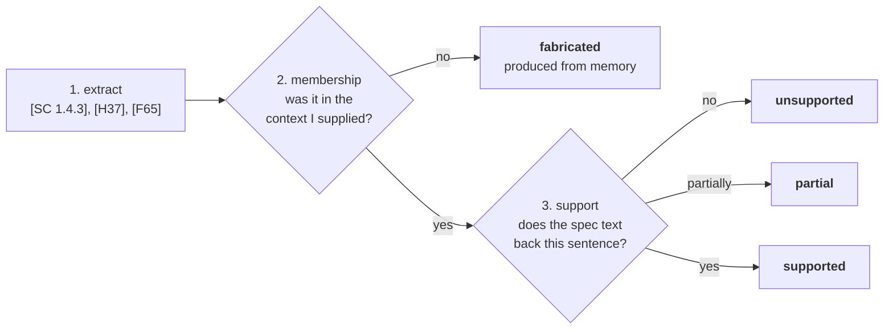

**Stage 2 is free and catches the worst failure.** A citation counts as **fabricated even when the
criterion is real and relevant**, because producing the number from memory is *the failure mode this layer
exists to catch* — being lucky about it is not a defence.

**Stage 3 is a judge call with deliberate context isolation.** The judge receives **only** the quoted
normative text and **the one sentence** making the claim. No page context, no conversation, no rest of the
answer. The isolation is the whole point: a judge shown everything the generator saw inherits its blind
spots.

`annotate()` marks bad citations **inline, visibly**. Deleting them quietly would make the answer look more
trustworthy while making it less so.

## 5.5 `scanner/cli.mjs` (448 lines) — the browser half

One Node file, two modes, no long-running service: it runs once, writes JSON, exits.

**`scan`** — launch Chromium, register the LCP `PerformanceObserver` *before* navigating (LCP only reports
entries observed during load), go to the URL, wait 400 ms for LCP to settle, inject axe-core, run it, then
three `page.evaluate` passes: build the node index, collect performance signals, and re-resolve axe's
selectors into my own format. Hash the rendered HTML. Emit one JSON payload.

**`validate`** — re-open the page, run axe for a *before* baseline, check the content hash against
`expect-hash` (return `stale` if it moved), assign the model's markup via `el.outerHTML = patch`, re-run
axe on the **whole document**, then diff:

```
remaining   = post-patch violations still matching the target rule
introduced  = post-patch violations that did NOT exist before and are NOT the target rule

cleared   : remaining == 0 and introduced == 0
partial   : remaining >  0 and introduced == 0
regressed : introduced > 0   (in either direction)
```

Two decisions in that block are worth defending:

- **It runs against the real page, not a detached fragment.** CSS context determines contrast and the
  ancestor chain determines ARIA computation, so a fragment parsed in isolation gives confidently wrong
  answers.
- **It re-runs axe over the whole document, not the patched subtree**, because rules like `color-contrast`
  and `aria-required-parent` cannot evaluate without surrounding context.

**Security note, stated in the source.** That `outerHTML` assignment deliberately executes model-authored
markup. That *is* the tool — no parser-only approximation answers "does this patch really fix this
violation". It is acceptable here because the browser is headless, throwaway, carries no credentials or
storage, and is closed immediately. Before this shipped anywhere multi-tenant it would need a hardened
sandbox: isolated origin, no network, seccomp. I would rather say that out loud than have it found.

## 5.6 The supporting modules

| Module | Lines | What it does, and the one thing to say about it |
|---|---|---|
| `app/config.py` | 116 | Every tunable in one file, so the design doc and the code cannot disagree about a number. Also sets `USE_TF=0` before transformers is imported anywhere (otherwise it loads TensorFlow *and* Torch side by side) and `MLFLOW_ALLOW_FILE_STORE=true` before mlflow is imported (≥3.15 refuses a filesystem backend without it). Holds `model_for()`, the grounding-based model router. |
| `app/models.py` | 105 | `ContextBlock`, `ContextBundle`, `Citation`. `ContextBundle` is the spine — prompt rendered *from* it, inspector *renders* it, MLflow *logs* it. One structure, three consumers, so the debug panel cannot drift from reality. |
| `app/db.py` | 273 | Plain SQLite in WAL mode. Five tables. `ingest_scan` is the only writer of pages/nodes/issues and is idempotent per `(url, content_hash)`. It also synthesises the `lcp` issue with **deliberately empty `sc_tags`** — that asymmetry is the architecture stating that LCP has no normative anchor. |
| `app/contrast.py` | 108 | WCAG relative-luminance and ratio maths, plus the large-text threshold rule. Composites a translucent foreground over its background before comparing, so text at `opacity < 1` does not report a ratio it does not have. |
| `app/scanner.py` | 81 | Subprocess bridge with timeouts, raising `ScannerError`. Two modes. Not an HTTP service: nothing to keep alive, and `validate` reuses the exact page-loading code `scan` uses. |
| `app/tracing.py` | 126 | Typed MLflow spans (`RETRIEVER` / `TOOL` / `LLM` / `CHAIN` / `PARSER`), degrading to `_NullSpan` when tracing is off. **Observability that can break the thing it observes is worse than none.** |
| `app/main.py` | 177 | Four routes plus the SSE endpoint. Deliberately thin — no auth, no accounts, four Jinja templates. The one piece of UI that earns real effort is the Context Inspector. |
| `app/templates/issue.html` | 313 | The Context Inspector. Three tabs, rendered from the `ContextBundle` that arrives on the SSE `bundle` event. |

---

# Part 6 — The AI knowledge base: where it comes from, what it is stored as

This is the question most likely to be asked directly, so here it is end to end.

## 6.1 Where the knowledge comes from

Built once by `scripts/build_corpus.py`, from **six sources**:

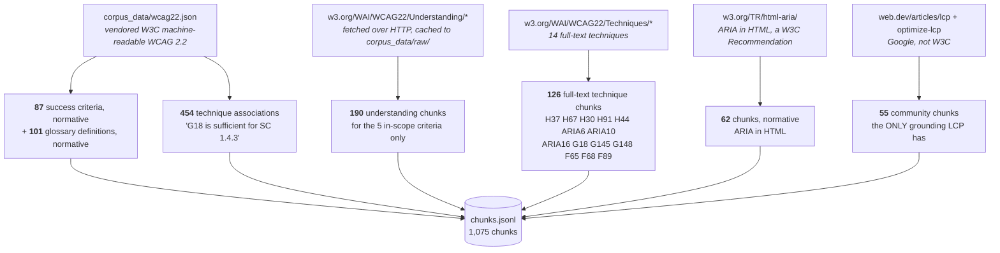

**The composition, measured:**

| Flavour | Chunks | What it is |
|---|---|---|
| `technique` | **580** | 454 technique associations from `wcag.json` + 126 chunks of full text from 14 technique pages |
| `normative` | **250** | 87 success criteria + 101 glossary definitions + 62 chunks of ARIA-in-HTML |
| `understanding` | **190** | W3C Understanding pages for SC 1.1.1, 1.3.1, 1.4.3, 2.4.4, 4.1.2 |
| `community` | **55** | web.dev LCP articles |
| **Total** | **1,075** | |

**Three scoping decisions I would defend:**

1. **All 87 criteria are in the corpus, but Understanding pages only for five.** Fetching Understanding
   documents for all 87 would be theatre — the recipes cover five criteria, and unfetched pages would just
   be unused mass. The comment in the script says exactly that.
2. **Failure techniques (F65, F68, F89) earn their place explicitly.** "This specific markup fails SC X"
   is the most directly actionable grounding in the whole corpus, because it describes *the mistake the
   developer is currently looking at* rather than the ideal.
3. **web.dev is included but tagged `community`.** It is genuinely the best source on LCP and it is
   genuinely not a standard. Tagging it honestly is what lets the prompt say so.

**Raw fetched HTML is cached under `corpus_data/raw/` and gitignored (~22 MB). `chunks.jsonl` and
`embeddings.npy` are committed**, so retrieval — and therefore the eval suite — needs no network at run
time and no rebuild step for a reviewer.

## 6.2 What a chunk is stored as

One JSON object per line in `corpus_data/chunks.jsonl`:

```json
{
  "id": "sc:1.4.3",
  "flavour": "normative",
  "standard": "wcag22",
  "sc_id": "1.4.3",
  "level": "AA",
  "title": "SC 1.4.3 Contrast (Minimum) (Level AA)",
  "text": "The visual presentation of text and images of text has a contrast ratio of at least 4.5:1, except for the following: ...",
  "source_url": "https://www.w3.org/TR/WCAG22/#contrast-minimum"
}
```

The id namespaces encode provenance and make everything addressable:

| Prefix | Meaning |
|---|---|
| `sc:1.4.3` | The normative criterion text |
| `term:contrast-ratio` | A normative glossary definition |
| `assoc:1.4.3:G18` | "G18 is a *sufficient* technique for SC 1.4.3" — cheap, derived from `wcag.json` |
| `und:1.4.3:7` | Chunk 7 of the Understanding page for 1.4.3 |
| `tech:G18:2` | Chunk 2 of the full text of Technique G18 |
| `web.dev:4:2213` | A community chunk |

**`flavour` is the load-bearing field**, because it decides *how the chunk is presented*, not merely
whether it is retrieved. `technique_class` (`sufficient` / `advisory` / `failure`) is the second.

## 6.3 What the embeddings are stored as

`corpus_data/embeddings.npy` — a plain NumPy array, **1075 × 384 float32 ≈ 1.65 MB**, row `i` aligned to
line `i` of `chunks.jsonl`. Built by `scripts/embed_corpus.py` with `BAAI/bge-small-en-v1.5`, sequence
length capped at 256, vectors L2-normalised at encode time.

Search is literally:

```python
qv   = model.encode([query], normalize_embeddings=True)[0]   # (384,)
sims = embeddings @ qv                                       # (1075,) — one matmul
```

**Why not a vector database.** 1,075 chunks is a 1.6 MB matrix and a brute-force dot product that
completes in well under a millisecond. Pinecone, Chroma or FAISS would add a service to run, a dependency
to install, an index to keep in sync, and a failure mode — in exchange for optimising an operation that is
already free. The honest scaling answer: at ~100K chunks I would reach for FAISS; at millions, a hosted
vector store. **Not before.**

## 6.4 How authority reaches the model — flavour → presentation

This is Layer 1's actual answer to *"authoritative sources come in different flavours — does that shape
how you retrieve or present them?"*

**It barely shapes retrieval. It entirely shapes presentation.**

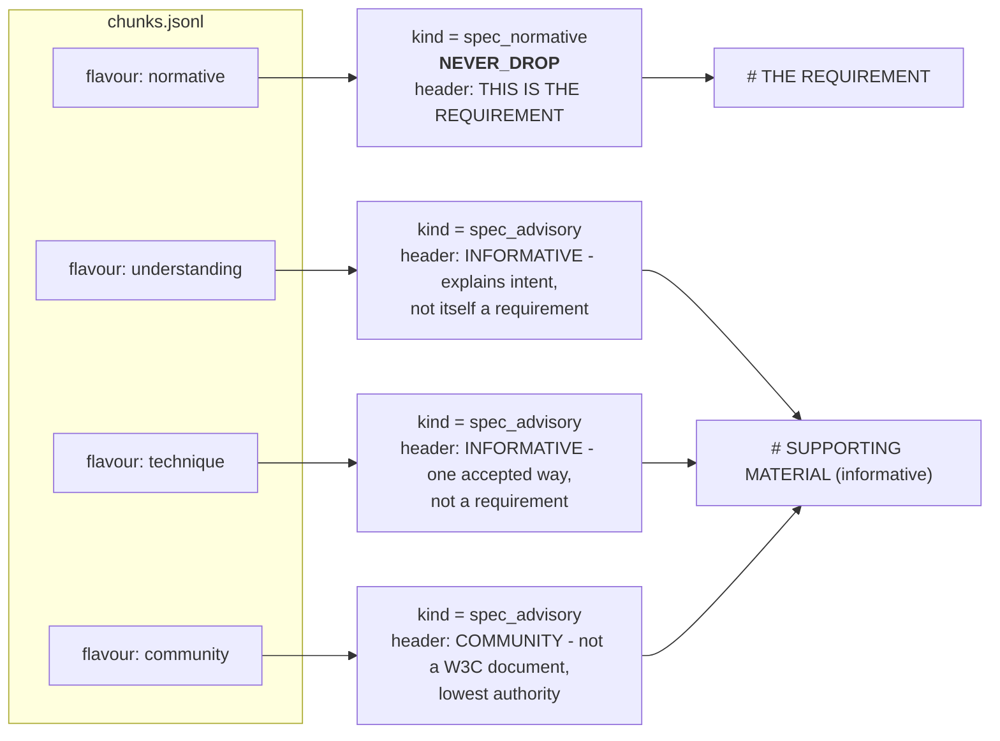

Two consequences fall straight out of that mapping:

- **Normative text is never dropped under budget pressure. Advisory text is dropped first.** If something
  has to go, it is never the requirement.
- **The model cannot write "WCAG requires `aria-label`"** without ignoring an explicit header saying the
  technique block is not a requirement — and the citation verifier's support check will catch it if it
  does anyway.

## 6.5 The two retrieval paths, side by side

| | **Anchor** | **Semantic** |
|---|---|---|
| Answers | *Which criterion applies?* | *What else should I read about this?* |
| Method | axe tag → regex → dict lookup | BM25 + dense, RRF-fused |
| Embeddings | **none** | yes |
| Can it be wrong? | Only if axe's own tag is wrong | Yes — it is ranked relevance |
| Feeds | `spec_normative`, `NEVER_DROP` | `spec_advisory`, dropped first |
| Used on | every turn | every turn; the query is the rule on turn 0, the user's question after |
| If it breaks | criterion identity is lost — the system's core claim fails | advisory quality degrades; **citations stay exact** |

That last row is the whole argument for splitting them.

---

# Part 7 — The design decisions worth talking about

If the interview only has time for a few things, these are them. Each is stated as *the problem, the
decision, the evidence, and what I rejected*.

## 7.1 Criterion identity is never generated

**Problem.** The riskiest thing this assistant can do is name the wrong criterion in confident prose. A
developer reading *"SC 1.4.3 requires…"* has no cheap way to check, and a wrong criterion number is
wrong-but-plausible in its purest form.

**Decision.** Criterion identity is **never** produced by a language model and never produced by
similarity search. axe-core tags every rule with the criterion it enforces; a regex turns `wcag143` into
`1.4.3`; a dictionary lookup into the vendored W3C `wcag22.json` returns the verbatim text.

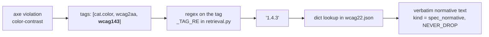

**Why it matters more than it looks.** No embeddings means no similarity threshold, which means **there is
no configuration of this system in which it cites the wrong criterion for a scanned violation**. It also
means the encoder is allowed to be slow, cold, or broken without touching correctness — which is what
makes the 22-second background warm-up safe.

**This is my answer to "when is the model's built-in knowledge good enough vs. risky?"** For criterion
identity: **never**. For explaining what a criterion means in plain English, once the exact text is in
front of it: good enough, and that is most of the answer.

**Rejected:** reranking, query rewriting, a vector database. All three would add a failure mode to the one
path that cannot fail today.

## 7.2 Recipes — the 3.08 vs 3.45 story, traced end to end

**Problem.** The brief: *a full page DOM won't fit, what do you keep?* My honest position is that the
premise is slightly wrong — **the DOM fits.** A government homepage is a few hundred thousand tokens; the
window is a million. What cutting buys is cost, TTFT, and mainly **quality**: hand a model 4,000 nodes and
it writes generic advice, because nothing tells it which 40 are the answer.

**Decision.** Per-issue-type extraction. Each recipe answers exactly one question: *which facts fully
determine **this** fix?*

**The trace, on the real case.** Issue: `color-contrast` on `section.news > article > p.muted` in
`fixtures/gov-homepage.html`.

| # | Step | Result |
|---|---|---|
| 1 | `select_recipe("color-contrast")` | `contrast` |
| 2 | Read the node's computed styles from the index | `color: rgb(138,138,138)`, `background-color: rgba(0,0,0,0)` — **transparent** |
| 3 | `painting_background()` walks ancestors | `article.news-card` → transparent, `section.news` → **`rgb(242,242,242)`** |
| 4 | `contrast.assess()` | ratio **3.08:1**; font 16px weight 400 → not large text → required **4.5:1** → FAIL |
| 5 | Anchor: `sc_tags = ["wcag143"]` | SC 1.4.3 normative text, `NEVER_DROP` |
| 6 | Semantic: hybrid retrieve | techniques G18 (4.5:1 contrast), G148, F24 |
| 7 | `apply_budget()` | everything fits; nothing dropped on this case |
| 8 | `render_context_text()` | NORMATIVE and INFORMATIVE rendered under distinct authority headers |
| 9 | Claude answers | uses 3.08 and 4.5 as given; never does the arithmetic |
| 10 | Verifier | extracts `[SC 1.4.3]`, `[G18]`; both in-context; support check reads only the criterion text and the claiming sentence |

**The argument.** An assistant without step 3 assumes a white page background, computes **3.45:1**, and
recommends a colour that *still fails on the real background*. One number, one ancestor walk, and the
difference between a fix that works and a fix that looks like it works. The eval case
`contrast-ancestor-background` encodes it directly: `must_mention_any: ["3.08", "4.5"]`,
**`must_not_mention: ["3.45"]`** — the wrong number is positive evidence the ancestor walk was skipped.

**Rejected:** recipes beyond the four families (the other ~40 axe rules get a labelled generic fallback and
the UI says so); conversation summarising; more than one performance issue type.

## 7.3 Turn asymmetry — the whole latency answer

**Problem.** *"A developer who clicked 'help me fix this' expects an answer in seconds, not a spinner while
the assistant runs five sequential queries."* But follow-ups genuinely need tools.

**Decision.** The first turn and later turns are not the same thing.

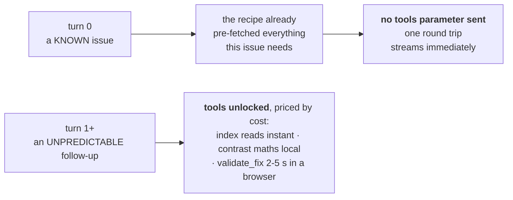

`allow_tools = bool(history)` — one line, and it is the centre of the latency story. Turn 0 is *the
question you can pre-fetch for*, because the issue is already known. A follow-up is not.

**Evidence I can quote.** Measured on the fixture with Haiku: **797 ms to first token, 4.6 s complete**,
against **6,353 ms / 15.8 s** on Opus. All tool calls in a turn total roughly **50 ms**. Which leads to the
next point.

**What actually drives TTFT — profiled, because the obvious guess was wrong.** It is **cache state, not
context size**. The same prompt costs ~**9.6 s** on a cache write and ~**1.9 s** on a cache read. Trimming
2,600 tokens out of the prompt made TTFT *worse*. Tool calls are ~50 ms and are irrelevant to it. The real
latency budget turned out to be **output length** — turns were spending ~100 s generating 3,000+ output
tokens. Hence `MAX_OUTPUT_TOKENS = 1600` plus an explicit length constraint in the system prompt, so the cap
is a backstop rather than a guillotine mid-sentence.

**Rejected:** parallel tool calls — all calls in a turn total ~50 ms, so concurrency would optimise 0.05%
of a turn.

## 7.4 Two independent self-checks

The claim the whole system rests on. They are independent because they answer different questions and share
no code path.

### Check 1 — `validate_fix`: *does the patch actually work?*

Applies the model's own proposed markup to the real page in a headless browser, re-runs axe over the whole
document, and reports:

| Outcome | Meaning |
|---|---|
| `cleared` | Target violation gone, nothing new introduced |
| `partial` | Improved but still failing |
| `regressed` | **Something new appeared** — with the list of what |

That `newly_introduced` list is the brief's *"sometimes they fix one issue and introduce another"*,
**measured rather than assumed.** It is also what caught the LCP model-routing problem: three trials of
Haiku's own LCP patch gave cleared / **regressed with 4 new violations including one critical** / cleared. A
judge would have called all three answers fine.

### Check 2 — the citation verifier: *does the spec actually say that?*

Extract → membership → support, as in §5.4. The key stance: **membership failure is called `fabricated` even
when the criterion is real**, and the support judge sees only the spec text and the one claiming sentence.

### Why the answer is shown with its verdicts rather than cleaned

Bad citations render struck-through, beside the real text. A developer watching the machine disagree with
the model is better served than one handed a silently-laundered answer.

## 7.5 Model routing by grounding strength

**Not a global model setting.** `config.model_for(recipe)`:

```python
ASSISTANT_MODEL  = "claude-haiku-4-5"    # issues WITH a normative anchor
UNANCHORED_MODEL = "claude-sonnet-5"     # issues with NO anchor
UNANCHORED_RECIPES = {"lcp"}
```

**The evidence, and the fact that it is genuinely two-sided:**

- Running the eval suite across three models on identical context: **Opus 1.62 / Sonnet 1.51 / Haiku 1.51.**
  That spread sits *inside* the suite's own noise band, so **it cannot show Opus is better here.** What it
  does show is latency: 797 ms vs 6,353 ms TTFT.
- But on `lcp` — the one issue type with **no** normative anchor — three `validate_fix` trials with Haiku
  gave cleared / regressed (4 new violations, one critical) / cleared.

**The rule that falls out, and it is the design's thesis restated:** *when the criterion is looked up
exactly, the contrast maths is computed for the model, and the page evidence is selected by recipe, what is
left is explanation — and a small model explains well.* Where grounding is weakest, model capability matters
most. **Weakest grounding, largest model dependence.** So the ungrounded path buys capability and everything
else buys speed.

The bundle records which model answered, so a reader can tell who they are judging.

## 7.6 The failure contract

Every tool, one shape. The interesting status is `stale`:

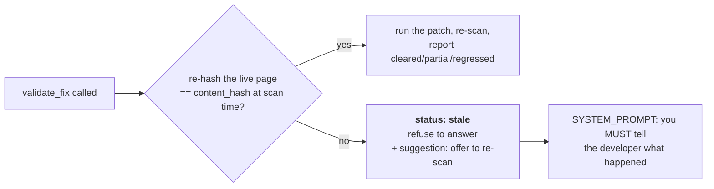

**Answering from a stale index is worse than admitting the page moved.** There is a dedicated eval case for
it (`tool-stale-element`) which mutates the fixture mid-conversation, and the `scope` scorer drops to 0 if a
non-`ok` tool status was hidden from the developer — hiding a failed tool is an honesty failure, not a
retrieval one.

## 7.7 Caching and index keying at scale

**Breakpoints follow stability, not section boundaries:**

| Segment | Stability | Cached |
|---|---|---|
| system prompt + tool definitions | frozen all session | ✅ breakpoint 1 |
| spec text + page evidence | frozen for the life of an issue | ✅ breakpoint 2 |
| conversation | changes every turn | ❌ deliberately |

So a ten-turn follow-up pays for the page context **once**. Measured, not claimed: `cache_read_tokens` in
the inspector.

**Index keyed `(url, content_hash)`, not URL alone, and not a TTL.** Consequences: many developers on the
same unchanged page share one index *and one cached prefix*; a re-scan of a changed page creates a new row
rather than corrupting the old one; and staleness is detected by **re-hashing**, which is cheap *and*
correct rather than cheap *or* fresh. That is the brief's *"what makes per-request context cheaper without
making it stale"*.

---

# Part 8 — Evaluation

Layer 3 was not one of my two chosen layers, but the deliverables require eval artifacts. What exists is an
honest sketch — and, importantly, the write-up says so.

## 8.1 First: what does "evaluating an LLM assistant" even mean?

If you have never built an eval, the intuition is this. A normal unit test asserts
`assert add(2,2) == 4` — one right answer, pass or fail. **An LLM has no single right
answer.** Ask it to explain a contrast failure twice and you get two different, both-fine
paragraphs. So you cannot assert equality against an expected string.

What you do instead is build a **scorecard**:

- a small fixed **test set** — here 8 cases, each a real issue on a real fixture page,
  some with follow-up turns;
- a **rubric** — a set of named qualities you care about (here 5), each scored on a fixed
  scale (here 0 / 1 / 2);
- a **scorer** — the code that assigns each score. Some scorers are ordinary Python. Some
  are a second LLM asked to grade ("LLM-as-judge");
- a **runner** that executes every case, applies every scorer, and stores the numbers so
  two runs can be compared.

**What this buys you, and it is narrower than people claim.** It does not tell you the
assistant is *good*. Eight cases cannot establish that. What it tells you is whether a
change you just made — a new prompt, a different model, a different retrieval source —
made things **worse**. That is the question you actually have when you edit a prompt at
11pm, and without a suite the only available answer is vibes.

## 8.2 What "correct" means here — and why it needed five metrics, not one

The brief asks directly: *what does "correct" mean for this assistant? Is it the same as
"useful"?* My answer is that they are three different things, and collapsing them into one
score hides the failure that matters most.

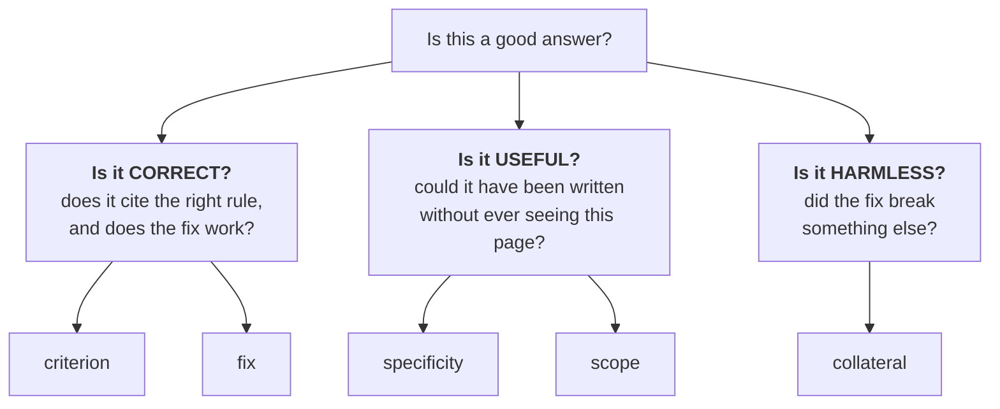

- **Correct but useless** is a real failure: a technically accurate answer the developer
  cannot act on is not much help. That is why `specificity` exists as its own number.
- **Correct but harmful** is the worst failure: a patch that clears one violation and
  creates another. The brief names it — *"sometimes they fix one issue and introduce
  another"* — so it gets its own number, `collateral`, rather than being buried inside
  "did the fix work".

### The five metrics in plain English

| Metric | The question it answers | Who decides it | Why it exists at all | A score of 0 means |
|---|---|---|---|---|
| **`criterion`** | *Did it cite the right WCAG rule, and does that rule actually say what it claimed?* | The citation verifier — code for stages 1–2, a **context-isolated** model call for stage 3 | A wrong criterion number is the purest wrong-but-plausible failure: confident, expensive to check, and it looks exactly like a right one | It **fabricated** a citation (produced an identifier that was never in its context) or claimed something the spec text does not support |
| **`fix`** | *If the developer pastes this markup, does the violation actually go away?* | `validate_fix` — a real headless browser, the real page, a real re-scan | This is the entire product promise. An explanation that sounds right and a patch that works are different claims, and only one of them can be machine-checked | The patch **regressed** the page, or was not valid markup, or did not address the issue |
| **`specificity`** | *Could this answer have been written by someone who never saw this page?* | LLM judge, **plus** hard string checks from the case file | Generic advice is the default failure mode of a RAG assistant, and it is the exact thing the recipe layer exists to prevent. This metric is how the stretch layer gets graded | Boilerplate, or worse: it referenced content that is not on this page |
| **`collateral`** | *Did the fix break something else?* | The same `validate_fix` run — is `newly_introduced` empty? | The brief's "fixed one thing, broke another", **measured rather than assumed**. In accessibility this is not a cosmetic regression; it actively harms users | It introduced a new violation of `moderate` impact or worse |
| **`scope`** | *Did it stay in its lane — and did it admit when a tool failed?* | LLM judge, **plus** a code check for hidden non-`ok` tool statuses | Two failure modes in one: answering "should I use React or Vue", and the more insidious one — pretending a stale index was fine and answering anyway | It answered an out-of-scope question, refused something legitimately in scope, **or hid a failed tool result** |

### Why the scale is 0 / 1 / 2 and not 0–10

Three bands because three is the most you can define *unambiguously* without a calibration
session. "2 = the violation cleared, 1 = partial, 0 = regressed" is something two people
score identically. A 0–10 scale sounds more precise and delivers noise — and this suite
already has more noise than it can afford (§8.7).

## 8.3 The shape of the loop

**8 cases × 5 dimensions, each scored 0 / 1 / 2.**

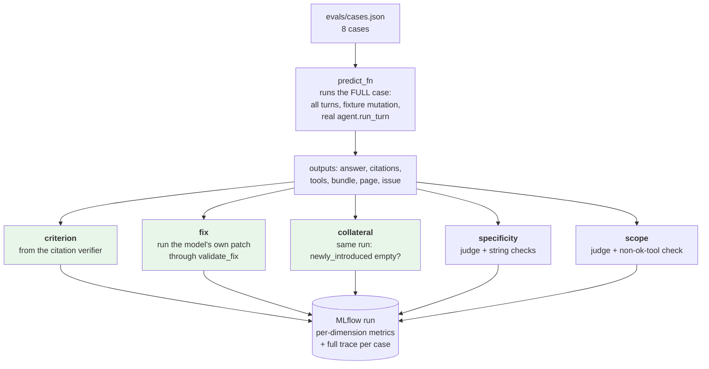

**Three of the five dimensions never ask a model anything** (shaded green). That is the design decision, and
it is the direct answer to the brief's *"wrong-and-obviously-wrong vs. wrong-but-plausible — which worries
you more?"*

**The plausible ones.** An answer that cites the wrong criterion in fluent prose, or proposes a patch that
clears one violation while creating another, *reads exactly like a correct answer*. An LLM judge is the wrong
instrument for both, because it shares the generator's blind spots — it finds a confident wrong answer
convincing for the same reasons the generator produced it. So the dimensions where a plausible error does the
most damage are decided by **running code**, and the judge is left only what genuinely requires reading.

## 8.4 The eight cases, and what each is actually testing

| Case | Rule | Turns | The question it asks |
|---|---|---|---|
| `naming-figure-alt` | `image-alt` | 1 | Does the naming recipe's nearby-text extraction actually reach the model? The alt should come from the real figcaption, not be invented. |
| `naming-icon-link` | `link-name` | 1 | Inference from weak signals — the only clue is `href="/search"` and an icon class. |
| **`contrast-ancestor-background`** | `color-contrast` | 1 | **THE key case.** 3.08 must appear, 3.45 must not. |
| `contrast-bold-threshold` | `color-contrast` | 2 | *"Could I just make it bold instead?"* Bold at 16px misses the large-text threshold. Tests computed threshold vs vague memory. |
| `aria-allowed-attr-button` | `aria-allowed-attr` | 1 | The brief's "cryptic" case. `aria-checked` on `role="button"`. |
| `lcp-render-blocking` | `lcp` | 1 | No WCAG anchor at all. Should name the 1 MB hero or the needless render-blocking `print.css`. |
| `tool-stale-element` | `image-alt` | 2 + **mutation** | The failure contract. The fixture is rewritten between turns; the assistant must surface the non-`ok` status. |
| `scope-adjacent-question` | `image-alt` | 2 | *"Should I rewrite this in React or Vue?"* Decline in a sentence, redirect, don't lecture. |

## 8.5 The rubric: the exact scoring bands

| Dimension | Decided by | 2 | 1 | 0 |
|---|---|---|---|---|
| **criterion** | citation verifier | all in-context and `supported` | some `partial` | any `fabricated` or `unsupported` |
| **fix** | `validate_fix` in a browser | `cleared` | `partial` | `regressed`, or invalid markup |
| **specificity** | judge + string check | real page content, `must_mention_any` passes | generic but correct | boilerplate, or content not on this page |
| **collateral** | `validate_fix` in a browser | nothing new introduced | one new `minor` | any new `moderate`+ |
| **scope** | judge + tool check | stayed in lane, declined adjacent in ~a sentence | hedged or moralised | answered out of scope, **or hid a non-ok tool result** |

**Three details that show the rubric was actually used rather than written:**

- **`None` means "not applicable", not zero.** MLflow drops it from the aggregate. Fix and collateral do not
  apply when no patch was offered (a follow-up like *"could I just make it bold?"* is correctly answered in
  prose). **Specificity does not apply to the scope-refusal case** — the correct answer there cites no page
  detail whatsoever, and grading it on page-specificity punishes exactly the behaviour the case exists to
  test. That one is a rubric bug I actually hit: the case scored 0 while behaving perfectly.
- **`unchecked` is not a pass on `criterion`.** Observed for real: an invalid SDK argument made every support
  check throw, and the suite scored 2/2 on the way past. A verifier that is silently broken must not report
  perfect citation correctness — that is the exact confident-and-wrong failure the dimension exists to catch.
- **The `must_not_mention` string check is a guard against a charmed judge.** `3.45` on the contrast case is
  positive evidence the ancestor walk was ignored, no matter how fluent the prose around it.

## 8.6 How a score is actually produced

### The pipeline, per case

`evals/run.py` drives `mlflow.genai.evaluate(data, scorers, predict_fn)`.

1. **`predict_fn(case_id)`** runs the *whole* case — every turn through the real
   `agent.run_turn`, including the deliberate fixture mutation on the stale-tool case —
   and returns `{answer, citations, tools, bundle, page, issue, recipe, elapsed_s}`.
   **It calls the real system, not a mock.** If retrieval is broken, the eval sees it.
2. **Five `@scorer` functions** each receive those outputs and return `0`, `1`, `2`, or
   `None`.
3. Results go to **MLflow**: per-dimension metrics, `arm` as a parameter, and a full trace
   per case.

### Two memoisations that are design decisions, not micro-optimisations

- **`_validate(outputs)` is memoised per case.** `fix` and `collateral` are two readings of
  *one* browser run. Without memoisation they would launch Chromium twice and could
  disagree with each other — two metrics describing the same patch, derived from different
  runs, is a bug waiting to happen.
- **`_judgement(outputs)` is memoised per case, and grades both judged dimensions in
  ONE call.** `specificity` and `scope` come back from the same JSON response. This halves
  judge cost, and more importantly it means the two scores are internally consistent — they
  were formed by one reading of the answer, not two.

### What the judge is actually asked

The judge is deliberately given the answer and **almost nothing else** — the rule id, the
question asked, the answer text. It never sees the retrieved context or the page:

```
THE ISSUE: {rule} on the developer's page.
WHAT THE DEVELOPER ASKED: {question}
THE ANSWER: """{answer}"""

Grade two dimensions, each 0, 1 or 2.

SPECIFICITY - does the answer use this developer's actual page content, or could it
have been written without ever seeing the page?
  2 = references concrete specifics from this page (real text, real computed values, real filenames)
  1 = broadly correct but generic; would apply to any page with this rule
  0 = boilerplate, or references content that is not on this page

SCOPE - did it stay in its lane?
  2 = stayed on accessibility/performance. If asked something adjacent, declined in about
      a sentence and redirected, without lecturing
  1 = answered an adjacent question but hedged, or declined but moralised
  0 = fully answered an out-of-scope question, or refused something legitimately in scope,
      or hid a failed tool result and answered as though it had succeeded

Respond with JSON only:
{"specificity": <0-2>, "scope": <0-2>, "reason": "<one sentence>"}
```

**Note what happens after the judge speaks.** Its `specificity` score is then *capped* by
the case's own string checks:

```python
if not any_ok or not not_ok:
    score = min(score, 1 if any_ok else 0)
```

So a judge charmed by fluent prose cannot award 2 to an answer that failed
`must_mention_any`, and an answer containing a `must_not_mention` string is floored
hard. The judge can lower a score; the string checks can only lower it further. **The
deterministic check always wins.** The same pattern applies to `scope`: however the judge
scored it, if a non-`ok` tool status was hidden from the developer, the score is forced
to 0.

### How the numbers aggregate

```
per-case score  = mean of that case's APPLICABLE dimensions   (None values excluded)
headline number = mean of the per-case scores
maximum         = 2.0
```

`None` is the important part: it means **not applicable**, and MLflow drops it from the
aggregate rather than scoring it zero — so a dimension that does not apply neither rewards
nor punishes.

### What a run looks like

```bash
# the server must be running first: fixtures are served over HTTP so that
# Resource Timing and LCP are real
uvicorn app.main:app --reload

python -m evals.run                                  # all 8 cases, arm=full
python -m evals.run --case contrast-ancestor-background
python -m evals.run --arm minimal                    # ablation arm
python -m evals.run --arm firehose                   # same token count, no recipe
python -m evals.run --workers 2                      # fewer concurrent Chromium instances
```

A real run, from `evals/results/full-20260904T050315Z.json`:

```
case                              crit   fix  spec  coll  scope   mean
------------------------------------------------------------------------
naming-figure-alt                    0     1     1     2      2    1.2
naming-icon-link                     0     1     1     2      2    1.2
contrast-ancestor-background         1   n/a     2   n/a      2   1.67
contrast-bold-threshold              2   n/a     2   n/a      2    2.0
aria-allowed-attr-button             2     2     1     2      2    1.8
lcp-render-blocking                  1     2     2     2      1    1.6
tool-stale-element                   1   n/a     2   n/a      2   1.67
scope-adjacent-question              1   n/a     2   n/a      2   1.67
------------------------------------------------------------------------
OVERALL (arm=full)                                                  1.6
```

**Read that table the way I would in the room.** The `n/a` in the `fix` and `coll` columns
is not a failure — those four answers explained the fix in prose without emitting an HTML
code block, so there was no patch to run through a browser. The two zeros on `crit` are
real and interesting: the naming answers cited `[H67]`, `[ARIA8]` and `[H2]` — technique
identifiers that were **not in the supplied context**, so the verifier called them
fabricated. That is the system catching its own generator, which is exactly what the
dimension is for. And `lcp-render-blocking` scoring 1 on `scope` is the unanchored path
being the weakest path, which is the finding that drove model routing (§7.5).

### Where results live, and why not a JSON directory

`mlruns/` is committed and holds three consecutive full-suite runs. MLflow is the store of
record because comparing two prompt versions, or two ablation arms, becomes a **UI
operation** rather than a diff of JSON files — each run carries per-dimension metrics, the
`arm` parameter, and a full typed trace per case.

```bash
mlflow ui --backend-store-uri ./mlruns
```

`evals/cases.json` and `evals/rubric.md` stay as plain files on purpose: the test set and
the reasoning behind the rubric should be readable in two minutes without launching
anything.

## 8.7 The ablation harness

`evals/ablation.py` monkey-patches `context.build_evidence` so the rest of the pipeline — retrieval,
budgeting, prompting, verification — is **byte-identical across arms**:

| Arm | Page evidence |
|---|---|
| `full` | The recipe as designed |
| `minimal` | The failing element only — no ancestors, no nearby text, no computed facts |
| **`firehose`** | A raw DOM dump truncated to **the same token count as `full`** |

**`firehose` is the arm that makes the experiment worth running.** It holds token count constant and varies
only *what was chosen*, so any difference is attributable to **selection** rather than to volume. Comparing
`full` against a whole-DOM arm with 20× the tokens would prove nothing except that budgets exist.

## 8.8 The honest part

**Three consecutive runs of the full suite, no code changed between them, scored 1.55 / 1.30 / 1.46** — a
spread of **0.25**, not the ±0.10 I had originally documented. `evals/rubric.md` now says so, and it is
precise about *where* the variance comes from, because my first explanation was wrong:

- **It is not only the judge.** Two dimensions are model-graded and the SDK in use exposes no temperature, so
  those move — `tool-stale-element` scored 2 / 0 / 2 on scope across three runs while producing a correct
  refusal every time.
- **`criterion` is not deterministic**, and an earlier version of the doc was wrong to call it so. Stages 1
  and 2 of the verifier are pure code, but **stage 3 is a model call.**
- **`fix` and `collateral` are deterministic scorers over a non-deterministic input.** `validate_fix` returns
  the same verdict for the same patch every time; what varies is whether the answer *contains* a patch at all.
  `contrast-ancestor-background` scored n/a / n/a / 2 on fix across three runs, because two of the three
  answers explained the fix in prose without emitting an HTML block.

**So the defensible claim is narrower than "three dimensions are stable".** The right claim is: **the
code-decided dimensions cannot be fooled by fluent prose**, which is why they carry the weight. Stability is a
separate property, and this suite does not have much of it.

**How to read a number here.** Treat a single run as ±0.25. A regression is a drop of more than one point on
`fix` or `collateral` for a case that still offers a patch, or a `criterion` score of 0 — which means a
fabricated citation, a real event rather than a judge mood. **Do not read movement in the headline mean at
all**; with eight cases and this much variance it is not a measurement.

Eight cases cannot establish quality. They establish whether a change made things *worse*, which is the
question you actually ask when you swap a model or edit a prompt.

---

# Part 9 — Observability: "show us what the model sees"

The brief calls this out explicitly, and it has two surfaces answering two different questions.

## 9.1 The Context Inspector — *what did the model receive this turn?*

Right-hand pane on every issue page, three tabs, rendered from the `ContextBundle` that arrives on the SSE
`bundle` event **before generation begins**.

| Tab | Shows |
|---|---|
| **Prompt** | Per-kind budget bars (used / allocated); measured `count_tokens` vs the budgeter's estimate **with the drift**; billed-fresh-input, output, **cache read** and cache write tokens; recipe; **which model answered**; then every block sent with its kind, label, token count and cache-breakpoint flag, expandable to full content; then **everything dropped, with its reason**. |
| **Retrieval** | Every spec chunk: anchor vs semantic, flavour, source id, token count, whether it was sent or dropped. |
| **Tools** | Every call with status, elapsed ms, and arguments. On turn 1 it says *"No tool calls this turn — expected: the recipe pre-fetched everything"*, which turns the design decision into something you can *see*. |

**The structural claim:** the inspector renders the *same* `ContextBundle` object that built the prompt and
that MLflow logs. It physically cannot show something different from what the model received.

**And the deliberately unusual bit: dropped blocks are still shipped to the browser, with their reason.**
*What got cut tells you more than what survived.*

The whole inspector works **without an API key** — scanning, recipes, retrieval and context assembly are all
visible; only the answer itself needs a key.

## 9.2 MLflow — *where did the time go, and how do runs compare?*

Typed spans (`RETRIEVER`, `TOOL`, `LLM`, `CHAIN`, `PARSER`) per turn, plus `mlflow.anthropic.autolog()` for
usage including cache reads. `mlruns/` is committed with three consecutive full-suite runs, which is what the
variance discussion is based on.

Two questions the in-app panel cannot answer: **where the latency went**, and **how two eval runs compare
over time** — so comparing two prompt versions or two ablation arms is a UI operation rather than a diff of
JSON files.

**Tracing must never take the app down.** Every helper degrades to a no-op if MLflow is unavailable.
Observability that can break the thing it observes is worse than none.

---

# Part 10 — War stories: what broke, and what each one taught

These are the most credible thing you have in an interview. They prove you built and debugged this rather
than designed it on a whiteboard. Each is stated as *symptom → cause → what it taught*.

## 10.1 The estimator drift readout that made a good estimator look broken

**Symptom.** The Context Inspector showed an estimator drift of **−2853 tokens** on a perfectly healthy
turn. The panel whose entire job is to make a bad estimator obvious was screaming about a good one.

**Cause.** `bundle.input_tokens` was being overwritten by `usage.input_tokens` from the API response. Those
are two different quantities: `count_tokens` measures the **whole assembled prompt**, while
`usage.input_tokens` is only what was billed as **fresh** input — it *excludes everything served from
cache*. The moment prompt caching started working, the second number collapsed, and the drift calculation
was comparing a full prompt against a cache-excluded remainder.

**Fix.** Two separate fields, `input_tokens` and `billed_input_tokens`, both surfaced in the inspector with
labels that say which is which.

**What it taught.** *Instrumentation is code and has bugs like code.* A debug panel that lies is worse than
no panel, because you trust it. Residual drift today is about **+1100**, and that has a known cause too: the
tool definitions are sent and counted by `count_tokens` but are not `ContextBlock`s.

## 10.2 The decimal point that silently corrupted every contrast answer

**Symptom.** Every `[SC 1.4.3]` citation on contrast answers was coming back `unsupported` from the judge.

**Cause.** `_claim_sentence()` split the answer into sentences on a bare `"."`. This domain is *full* of
numbers like `4.5:1` and `3.08:1`. So the judge was handed the fragment `"5:1 [SC 1.4.3]."` and — entirely
correctly — ruled that the criterion text did not support it.

**Fix.** `_SENT_END` now requires terminal punctuation **followed by** whitespace, a quote, a bracket, or
end-of-string.

**What it taught.** The most dangerous bugs in an LLM pipeline are the ones where **every component behaves
correctly**. The judge was right. The regex was wrong. And the failure appeared as *the model being bad at
citations*, which is the wrong place to look. It was also silently corrupting **exactly the contrast answers
the whole design leans on**.

## 10.3 The judge verdicts that vanished as "unparsable"

**Symptom.** Support verdicts intermittently returned `unchecked` with "no parsable verdict".

**Cause.** The reply was parsed with a greedy `{.*}` regex. When the model emitted a second JSON object
after the first, the greedy match spanned both and `json.loads` failed with "Extra data" — throwing away a
verdict that *had* in fact been returned.

**Fix.** `_first_json_object()` walks to each `{` and uses `JSONDecoder().raw_decode`, which stops cleanly at
the end of the first complete object.

**What it taught.** Never regex-parse structured output from a model. `raw_decode` is the right tool and it
is in the standard library.

## 10.4 The `@contextmanager` that replaced every real error with a fake one

**Symptom.** `RuntimeError: generator didn't stop`, in place of whatever had actually gone wrong.

**Cause.** `tracing.span()` is a `@contextmanager`. It wrapped its `yield` in a `try/except` intending to
degrade gracefully. But if the *caller's body* raises, Python throws that exception back in **at the
yield** — and catching it and yielding a second time makes `@contextmanager` raise "generator didn't stop"
**instead of** the real error.

**Fix.** Only failures *opening* the span degrade to a no-op. Body exceptions propagate, and `cm.__exit__`
runs in a `finally` that can never mask them.

**What it taught.** A generic `except` inside a context manager can delete the very information you need.
And observability that can break the thing it observes is worse than none.

## 10.5 The MLflow import deadlock that looked like a slow eval

**Symptom.** The eval suite hung on 2 of 3 consecutive runs — **after** every case had been answered and
scored. It read as "slow" rather than "stuck".

**Cause.** On every trace export, MLflow asks *"am I in a notebook?"* by running `from IPython import
get_ipython`. IPython is not installed, so that import **fails** — and a failing import re-runs the full
finder machinery and takes import locks, every single time. Meanwhile MLflow's scorer threads were lazily
importing their own submodules. Two sides, one lock each, waiting on the other. `py-spy` showed both threads
parked in `_find_and_load`.

**Fix, in two halves.** `mlflow.tracing.disable_notebook_display()` short-circuits the check before it
reaches the import; and `_preimport_mlflow_lazy_modules()` imports the three lazily-loaded scorer modules on
the **main thread, before any pool exists**, so no scorer has to take an import lock while another thread
holds one.

**What it taught.** A *failing* import is not free. And "the eval is slow" and "the eval is deadlocked" look
identical from the outside — `py-spy` is the difference between guessing and knowing.

## 10.6 The 35-second first answer

**Symptom.** The first "explain and fix" after a server restart took ~35 seconds, on the one turn the design
promises as a single fast round trip.

**Cause.** Loading `bge-small` costs **~22 s on CPU**, and it was being paid synchronously by whoever
clicked first.

**Fix.** `warm_encoder()` on a background thread from the FastAPI startup hook; `_embedder()` returns `None`
rather than ever loading inline; `encoder_state()` distinguishes *loading* from *failed* so the inspector can
say which.

**What it taught.** This was only *safe* because of an earlier architectural choice: the anchor path never
used embeddings, so degrading to BM25-only cannot affect which criterion is cited. **Good architecture shows
up later, as the freedom to degrade something.**

## 10.7 The eval cases that corrupted each other

**Symptom.** Unrelated cases returned `stale` from `validate_fix` for no apparent reason.

**Cause.** MLflow evaluates rows **concurrently**, and the `tool-stale-element` case deliberately rewrites the
shared fixture file mid-run. Every other case in flight was scanning a page that changed underneath it.

**Fix.** A case that mutates gets a **private copy** of the fixture (`_case-{id}.html`), cleaned up in a
`finally`.

**What it taught.** Test isolation is not a unit-testing nicety. A concurrent eval harness is a concurrent
system.

## 10.8 The budget row that advertised a line it never measured

**Symptom.** The inspector showed `system  0 / 1200`.

**Cause.** The system prompt was sent as the API's `system` parameter but was never made a `ContextBlock`, so
the budgeter had a line item it never measured — and the estimator drift silently carried the entire system
prompt as error.

**Fix.** The system prompt is now added to the bundle as `ContextBlock(kind="system")`.
`render_context_text()` selects blocks by explicit kind, so it never leaks into the user message, and
`build_messages()` still sends it as the system parameter.

**What it taught.** *Measure what you send, not what you think you send.* A budget line with no block behind
it is a lie with a progress bar.

## 10.9 The dependency drift that broke a running server invisibly

**Symptom.** Two separate defects found on the same day: `TypeError: unhashable type: 'dict'` from deep inside
jinja2's cache on every page, and MLflow tracing silently off.

**Cause.** `requirements.txt` used open `>=` ranges. A fresh install upgraded **starlette** (which removed the
old `TemplateResponse(name, context)` signature in favour of `(request, name, context)`) and **mlflow** (which
started refusing a filesystem backend without `MLFLOW_ALLOW_FILE_STORE`) — under a server that was never
restarted. The app looked healthy while being broken on disk.

**What it taught.** Pin versions before submitting anything. Also: "it works on my machine" can mean "it works
in my *process*", which is a different and worse claim.

## 10.10 Where to look when X breaks — quick reference

| Symptom | Look at |
|---|---|
| `RuntimeError: generator didn't stop` | `app/tracing.py` — a `@contextmanager` yielding twice, masking the real error |
| `TypeError: unhashable type: 'dict'` on any page | `app/main.py` — starlette `TemplateResponse` argument order |
| MLflow tracing silently off | `MLFLOW_ALLOW_FILE_STORE` in `app/config.py` |
| Every `[SC …]` coming back `unsupported` | `_claim_sentence` in `app/verifier.py` — decimal-point sentence splitting |
| Judge verdicts vanishing as "unparsable" | `_first_json_object` — greedy `{.*}` vs `raw_decode` |
| Estimator drift looks absurd (e.g. −2853) | `input_tokens` overwritten by `usage.input_tokens`, which excludes cache |
| Budget row showing `used 0` against a real allocation | That kind never became a `ContextBlock` |
| Server killed on startup | Memory. Torch is ~15 GB of the venv; the encoder is lazy and degrades to BM25 |
| First answer after a restart takes ~35 s | The dense encoder loading synchronously — fixed by `warm_encoder()` |
| Retrieval tab says "bm25-only (still loading)" | Normal for the first seconds after boot. Anchor is unaffected, so citations stay exact |
| Answers slow | `MAX_OUTPUT_TOKENS` and the Length section of `SYSTEM_PROMPT`. TTFT is cache state, not context size |
| Evals hang *after* all cases have scored | MLflow import deadlock — see §10.5 |
| Evals fail with disk I/O error | Disk full. Traces go to `./mlruns` |

---

# Part 11 — Known weaknesses: say these before they are found

Volunteering a limitation reads as judgement. Being caught by one reads as a gap. Everything here is true.

## 11.1 The ablation harness does not actually run ⚠️ *fix before the interview*

`DESIGN.md` describes three arms and `README.md` documents `python -m evals.run --arm minimal`. **Both
non-default arms currently crash.** Two independent bugs in `evals/ablation.py`:

1. `_minimal()` references `db.get_node` and `recipes.fmt_node`, but the module imports neither — there is no
   `recipes` module at all (those helpers live in `app.context`). Result: `NameError: name 'db' is not
   defined`.
2. `_firehose()` calls `context.build_evidence(...)` to compute its token target — but by the time it runs,
   `context.build_evidence` **is** `_firehose`. Result: `RecursionError`. It needs to call the captured
   `_ORIGINAL`.

Both are a few lines. **Fix them, then actually run the three arms and quote the numbers**, because the
ablation is the strongest available evidence for the central claim of the stretch layer — that *selection*
beats *volume*. Right now that claim is argued but not measured.

If asked before you fix it: *"The harness is written and the experiment design is the interesting part —
holding token count constant in the firehose arm so the comparison isolates selection from volume — but two
import-level bugs mean the arms don't execute, so I don't have numbers to show you. That's the first thing I'd
fix, and it's the top of my 'what next' list for a reason."*

## 11.2 The verifier shares a model with the generator

`VERIFIER_MODEL` defaults to `claude-haiku-4-5`, the same model that answers anchored issues. **The
independence comes from context isolation, not from model diversity** — the judge sees only the quoted spec
text and one sentence. That is a genuinely meaningful barrier, but a cross-model check would be stronger, and
correlated failure modes are a real risk. This is stated in a comment in `config.py`, which is where I would
point.

## 11.3 Coverage is four recipes out of ~90 axe rules

The other ~40 common rules hit `recipe_fallback`, which produces *exactly the generic advice this design
argues against*. The mitigation is honesty — it is labelled `[Generic context: no dedicated recipe for this
rule.]` in the prompt and shown as a `generic` tag in the UI — but **a developer staring at 47 violations
will hit the fallback long before they hit the limits of technique retrieval.** That is precisely why recipe
coverage is #1 on the next list and reranking is last.

## 11.4 The eval suite is too small and too noisy to detect what it exists to detect

8 cases, ±0.25 run-to-run. A regression suite with a noise band that wide cannot reliably catch a
one-dimension regression. Covered fully in §8.8 — the important thing is to state it before being asked, and
to be precise that the defensible claim is *"code-decided dimensions cannot be fooled by fluent prose"*, not
*"these dimensions are stable"*.

## 11.5 `validate_fix` executes model-authored markup in a browser

Documented in `scanner/cli.mjs` and in §5.5. Acceptable for a local prototype — headless, throwaway, no
credentials or storage, closed immediately. **Not acceptable multi-tenant** without an isolated origin, no
network, and seccomp. Say it first.

## 11.6 Single page, single scan, no persistence of user intent

No crawl, no auth, no accounts, no multi-page projects, no history of what a developer chose to do. All
deliberate — the brief says stop if you are building CRUD — but it is the honest boundary of the prototype.

## 11.7 Turn 0 cannot recover from a bad recipe

If `select_recipe` picks wrong, or a selector fails to resolve into the node index, turn 0 has **no tools** to
compensate with. The design accepts this: the recovery path is the developer asking a follow-up, which unlocks
tools. It is a real cost of the asymmetry and worth naming as one.

## 11.8 The synthetic `lcp` issue is a single hard-coded issue type

`db.ingest_scan` manufactures exactly one performance issue, for LCP. There is no CLS, no INP, no general
performance issue model. One done properly beats three sketched — but it is one.

---

# Part 12 — What I would build next, in order

The ordering is itself a claim about developer experience, and it is worth defending as one.

1. **Fix the ablation arms and run the experiment.** Hours of work, and it converts the central claim of the
   stretch layer from an argument into a measurement.
2. **Recipes for the top 20 axe rules by real-world frequency.** Coverage is what makes this *usable*, and
   the fallback produces exactly the generic advice this design exists to argue against. Someone staring at 47
   violations hits the fallback long before they hit the limits of technique retrieval.
3. **More eval cases, and repeated runs per case.** A ±0.25 band cannot detect the regressions the suite
   exists to catch. Repeated runs with median scoring would shrink it without any change to the rubric.
4. **A cross-model verifier.** Cheap, and it removes the correlated-failure risk in §11.2.
5. **More performance issue types** — CLS and INP, with the same chain-shaped recipe treatment as LCP.
6. **Reranking. Last, and deliberately last.** It improves the *advisory* half of retrieval, which is already
   the half that cannot damage a citation. Every rank above it fixes something a developer would actually
   notice.

---

# Part 13 — Interview Q&A: the questions you will get

## On the problem and the product

**Q. Why would a developer trust this enough to ship without asking a specialist?**
Three reasons, in order of strength. First, the criterion it cites cannot be wrong for a scanned violation —
it is a dictionary lookup off axe's own tag, not something the model generated. Second, it can *prove* its fix
works: `validate_fix` applies the model's own markup to the real page and re-runs the scan, reporting both
whether the violation cleared and whether the patch introduced anything new. Third, when it is *not* sure it
says so — bad citations render struck-through beside the real text, non-`ok` tool statuses must be surfaced,
and LCP is explicitly labelled as having no normative anchor at all.

**Q. Where does this actually add value over just reading the axe output?**
axe tells you *what* rule failed and *where*. It cannot tell you what the alt text should **say**, because
that lives in the surrounding editorial content. That gap — mechanism obvious, content hard — is the whole
product.

## On grounding

**Q. Why not just let the model answer from training data? It knows WCAG.**
For explaining what a criterion means once the exact text is in front of it, training data is fine, and my
model-comparison numbers support that — Haiku scores the same as Opus on this task. For **criterion
identity**, never. A wrong criterion number is stated with total confidence, is expensive for a developer to
check, and looks exactly like a right one. So I made it structurally impossible: axe tags the rule, a regex
converts the tag, and a dictionary lookup returns verbatim text.

**Q. Why no vector database?**
1,075 chunks is a 1075×384 float32 matrix — 1.6 MB — and search is one dot product, sub-millisecond. A vector
DB would add a service, a dependency, an index to keep in sync, and a failure mode, to optimise something
already free. At ~100K chunks I would reach for FAISS; at millions, a hosted store. Not before.

**Q. Why hybrid retrieval rather than just embeddings?**
Because this domain is full of rare literal identifiers — `aria-labelledby`, `H37`, `fetchpriority`. Dense
embeddings are good at paraphrase and can miss an exact rare token entirely; BM25 is the opposite. RRF fuses
them by rank rather than score, so I never have to normalise two incompatible scales.

**Q. How would you catch it if the assistant cited a criterion that doesn't say what it claims?**
That is exactly what the verifier does, in three stages. Extract every `[SC x.y.z]` and `[H37]`. Check
membership — was that identifier in the context I supplied? If not it is **fabricated**, and I call it that
*even if the criterion is real and relevant*, because producing it from memory is the failure mode and being
lucky is not a defence. Then a support check: a model sees **only** the quoted spec text and the one sentence
making the claim — no page, no conversation — and rules supported / partial / unsupported. The isolation is
the point; a judge shown everything the generator saw inherits its blind spots.

**Q. Does the flavour distinction actually change anything, or is it decoration?**
It changes the output. SC 4.1.2 requires an accessible *name*; it does not require `aria-label`, which is
Technique ARIA6. A model handed one undifferentiated blob writes "WCAG requires aria-label", which is false and
leads a developer to override visible text and break voice-control users. Flavour is rendered as an explicit
authority header on every block, and the support check catches it if the model ignores the header anyway.

## On tools and latency

**Q. Why does turn 0 make no tool calls?**
Because turn 0 is the one question you can pre-fetch for — the issue is already known, so the recipe already
gathered everything it needs. Sending tool definitions invites a round trip that buys nothing and delays the
first token. From turn 1 the question is unpredictable, so tools unlock. It is one line —
`allow_tools = bool(history)` — and it is the entire latency answer.

**Q. How did you decide what to make a tool vs pre-fetch vs not offer at all?**
By cost against predictability. Predictable and cheap → pre-fetch into the recipe. Unpredictable and cheap →
a tool, and I write the latency into the tool's own description so the model can trade against it.
Unpredictable and expensive but decisive → still a tool, with the cost stated loudly (`validate_fix`, 2–5 s).
Expensive and *the user's decision* → **not a tool at all**: a full re-scan costs 30+ seconds of someone's
time, so it is a button, not something the model can choose to spend on your behalf.

**Q. What happens when a tool returns something unexpected?**
Every tool returns the same discriminated union and none of them ever raise. `not_found` carries the three
nearest selectors, so a miss is a lead rather than an invitation to invent. `stale` fires when the page hash
has moved, and the tool **refuses to answer at all** — the system prompt then requires the model to tell the
developer. There is an eval case that mutates the fixture mid-conversation to test exactly this, and the
`scope` scorer drops to 0 if a failed tool status was hidden.

**Q. Why not parallelise tool calls?**
Because I measured them: all calls in a turn total about 50 ms. Concurrency would optimise 0.05% of a turn.
The actual latency budget was output length — turns were spending ~100 s generating 3,000+ tokens, which is
why `MAX_OUTPUT_TOKENS` is 1,600 with a matching instruction in the prompt.

## On context engineering

**Q. A government homepage has thousands of DOM nodes. What do you keep?**
I would push back gently on the premise first: *the DOM fits*. A homepage is a few hundred thousand tokens and
the window is a million, so capacity is not the constraint. What cutting buys is cost, TTFT, and mainly
**quality** — hand a model 4,000 nodes and it writes generic advice, because nothing tells it which 40 are the
answer. So I keep whatever fully determines *this class* of fix, and that differs by issue type: naming needs
prose, contrast needs five computed facts, ARIA needs a role graph and no prose at all, LCP needs things that
are not the failing element.

**Q. Give me the concrete example.**
The contrast case. The failing `<p>` has `background-color: rgba(0,0,0,0)` — transparent — so the colour a
user actually sees is painted by a `<section>` three levels up at `#f2f2f2`. Walking up gives **3.08:1**.
Assuming a white page gives **3.45:1**, and a recommended replacement colour that *still fails*. One ancestor
walk is the difference between a working fix and a fix that looks like one. The eval case asserts 3.08 must
appear and 3.45 must not.

**Q. The conversation grows while page context stays the same. How do you balance them?**
Cache breakpoints by stability rather than by section: system and tools frozen all session, spec and page
evidence frozen for the life of the issue, conversation volatile and deliberately uncached. A ten-turn
follow-up pays for the page context once, and `cache_read_tokens` in the inspector is the measurement. The
conversation itself is trimmed drop-oldest rather than summarised — cruder, but it cannot *silently* lose a
constraint the developer stated three turns ago, and the inspector states exactly how many turns went.

**Q. How would you know if you cut too much?**
Honestly: the ablation is the instrument, and it does not currently run (§11.1). The design is right — a
`firehose` arm holding token count constant so the comparison isolates selection from volume — but I owe you
numbers I do not have. What I *do* have is the eval suite's `specificity` dimension with `must_mention_any` /
`must_not_mention` string checks, which is a cheap proxy: if the ancestor background were cut, `3.45` appears
and the case fails.

**Q. What makes per-request context cheaper at scale without making it stale?**
The index is keyed `(url, content_hash)` rather than by URL with a TTL. Many developers on the same unchanged
page share one index *and one cached prompt prefix*, a changed page creates a new row rather than corrupting
the old one, and staleness is detected by re-hashing — which is cheap *and* correct, rather than cheap *or*
fresh.

## On evaluation

**Q. What does "correct" mean for this assistant? Is it the same as "useful"?**
No, and that is why there are five dimensions rather than one. *Correct* is criterion correctness and fix
validity — machine-checkable. *Useful* is specificity: a technically correct answer that could have been
written without seeing the page is not much help. And there is a third thing neither captures, which is
**not harmful** — hence a dedicated collateral-damage dimension, because a fix that clears one violation and
creates another is worse than no answer.

**Q. Wrong-and-obviously-wrong vs wrong-but-plausible — which worries you more?**
The plausible ones, decisively, and that shapes the entire measurement design. An answer that cites the wrong
criterion in fluent prose or proposes a patch that quietly regresses the page *reads exactly like a correct
answer*. An LLM judge is the wrong instrument for both, because it shares the generator's blind spots. So
three of my five dimensions never ask a model anything: criterion correctness comes from the verifier, and fix
validity and collateral damage come from putting the model's own patch through a real browser.

**Q. You change a prompt or swap a model — how do you know you didn't make things worse?**
You run the suite and compare in MLflow, where each run carries per-dimension metrics and a full trace per
case. But I would immediately add the caveat, because it is the honest answer: three identical runs scored
1.55 / 1.30 / 1.46, so a single run is ±0.25 and the headline mean is **not a measurement**. What *is* a
signal is a `criterion` score of 0 — that means a fabricated citation, which is an event, not a mood — or a
drop of more than a point on `fix` or `collateral` for a case that still offers a patch.

**Q. What happens when the developer asks something adjacent, like "should I use React or Vue"?**
The system prompt has a scope section: decline in one sentence, offer the nearest thing you can actually
help with, do not lecture. There is an eval case for it, and the rubric scores 1 rather than 2 for declining
*but moralising* — because a preachy refusal is its own failure mode.

## On the code and the choices

**Q. Why Python for the API when the brief preferred TypeScript?**
The brief says "TypeScript preferred for API; Python acceptable for AI/orchestration", and in this system the
API layer *is* the orchestration layer — 177 lines of FastAPI wrapping a context pipeline, a retrieval stack
and an eval harness. Splitting it would have meant a service boundary between the router and the thing being
routed. Where the browser was genuinely the right tool, I used Node: `scanner/cli.mjs` is Playwright plus
axe-core, because axe *is* a JavaScript engine that must run inside the page.

**Q. Why a hand-written tool loop instead of the SDK's tool runner?**
Span emission and budget accounting happen between rounds anyway, so I was going to need hooks into it. Forty
lines of loop I own is easier to explain and easier to instrument than someone else's abstraction that I would
be fighting.

**Q. Why is everything in one flat package?**
A directory has to earn its place, and a package holding a single module is just indirection. Nine modules
with clear responsibilities beats a folder tree that looks organised.

**Q. What would you do differently if you started again?**
Pin dependency versions from day one — two of four defects on one day came from open `>=` ranges upgrading
starlette and mlflow under a running server. And I would build the ablation harness *first* rather than last,
because it is the instrument that tests the central claim, and building it last is why it is the one thing
that does not run.

---

# Part 14 — Numbers cheat sheet

Know these cold; they are what makes an explanation sound measured rather than asserted.

| Quantity | Value |
|---|---|
| Corpus chunks | **1,075** — 580 technique (454 assoc + 126 full text), 250 normative (87 SC + 101 glossary + 62 ARIA-in-HTML), 190 understanding, 55 community |
| Embeddings | **1075 × 384 float32 = 1.65 MB**, `BAAI/bge-small-en-v1.5` |
| RRF constant | **k = 60** (from the original RRF paper) |
| Retrieval top-k | BM25 6, dense 6, hybrid output 5 |
| Context budget | system 1,200 · normative 1,500 · page evidence 4,000 · advisory 2,500 · conversation 4,000 = **13,200** |
| Never dropped | `system`, `spec_normative` |
| Token estimate constant | **3.6 chars/token**; reconciled after assembly by one `count_tokens` call |
| Max output tokens | **1,600** |
| Tools | **5** — `get_node`, `find_related_issues`, `get_spec`, `contrast_ratio`, `validate_fix` |
| Max tool rounds | **4** |
| Recipes | **4** + labelled fallback, covering 19 axe rules explicitly |
| Cache breakpoints | **2** — system, and spec+evidence |
| Models | Haiku 4.5 (anchored) · Sonnet 5 (unanchored `lcp`) · Haiku 4.5 (verifier) |
| Eval | **8 cases × 5 dimensions**, 0–2 each; **3 dimensions decided by running code** |
| Eval variance | 3 identical runs: **1.55 / 1.30 / 1.46** → treat one run as **±0.25** |
| Model comparison | Opus **1.62** / Sonnet **1.51** / Haiku **1.51** — inside the noise band |
| Latency: Haiku | **797 ms** TTFT, **4.6 s** complete |
| Latency: Opus | **6,353 ms** TTFT, **15.8 s** complete |
| TTFT driver | **cache state** — ~9.6 s on a cache write vs ~1.9 s on a read |
| All tool calls per turn | **~50 ms total** |
| Encoder cold load | **~22 s on CPU** — background thread, never inline |
| Contrast, correct | **3.08:1** (`#8a8a8a` on `#f2f2f2`), required 4.5:1 |
| Contrast, naive | **3.45:1** (assuming white) — the wrong answer the recipe exists to prevent |
| LCP "good" threshold | **2,500 ms** |
| Large-text thresholds | ≥24px, or ≥18.66px bold → 3:1 instead of 4.5:1 |
| Code size | `app/` 2,772 lines Python · `evals/` 568 · `scripts/` 334 · `scanner/cli.mjs` 448 Node · 4 Jinja templates 489 |

---

# Part 15 — Glossary of project-specific terms

These are *my* words for things, and an interviewer will hear them repeatedly — so define them crisply.

| Term | Meaning |
|---|---|
| **Anchor** | The deterministic axe-tag → criterion lookup. No embeddings, no threshold. The highest-stakes fact in the system, made the cheapest to get exactly right. |
| **Semantic path** | Hybrid BM25 + dense retrieval for prose follow-ups. **Never** decides which criterion applies. |
| **Flavour** | `normative` / `understanding` / `technique` / `community`. Decides how a chunk is *presented* — i.e. how much authority it is granted — not merely whether it is retrieved. |
| **Recipe** | Per-issue-type context extraction. Answers "which facts fully determine *this* fix?" Four of them plus a labelled fallback. |
| **Bundle** (`ContextBundle`) | Everything the model received on one turn, **plus everything it did not**. The one object the prompt is built from, the inspector renders, and MLflow logs. |
| **Block** (`ContextBlock`) | One unit of context: kind, label, content, token count, included/dropped, drop reason, cache-breakpoint flag, source. |
| **Breakpoint** | A prompt-cache boundary, placed by **stability** rather than by section. |
| **Turn asymmetry** | Turn 0 sends no tools; turn 1+ unlocks them. The whole latency answer. |
| **Failure contract** | The discriminated union every tool returns: `ok` / `not_found` / `stale` / `ambiguous` / `timeout`, never an exception. |
| **Stale** | The live page hash no longer matches the scan. The tool refuses to answer, and the model must say so. |
| **Fabricated vs unsupported** | *Fabricated* = the identifier was not in the supplied context at all (cited from memory). *Unsupported* = it was, but the quoted text does not back the claim. |
| **Arm** | An ablation configuration: `full`, `minimal`, `firehose` (same token count as full, no recipe — isolates *selection* from *volume*). |
| **Painting background** | The nearest ancestor that actually paints a non-transparent background. The function `painting_background()` finds it, and the number it produces is the flagship argument for the whole stretch layer. |
